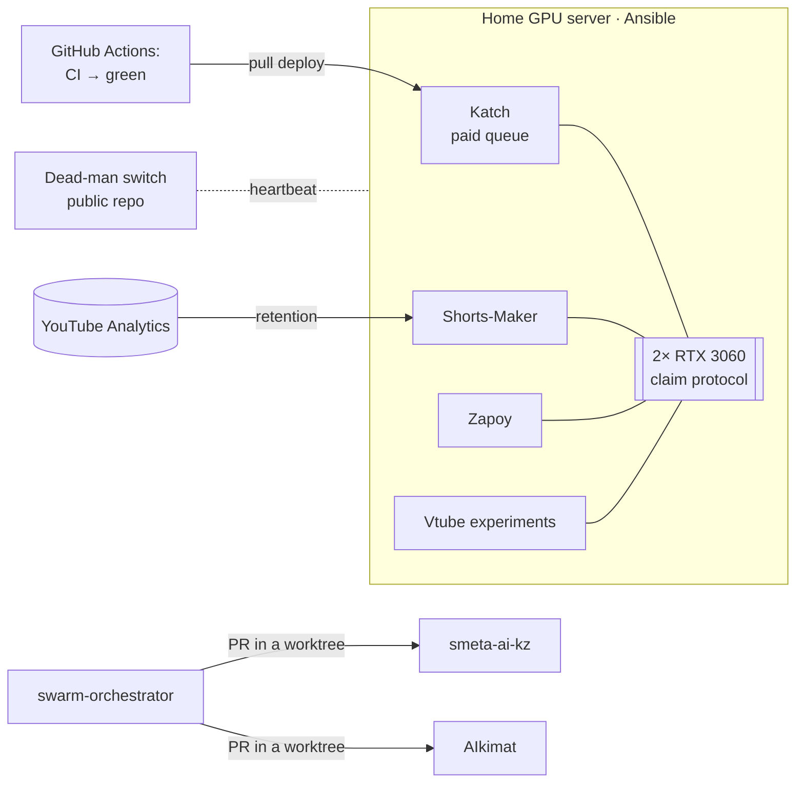

# Georgy Tolkachev · DevOps / MLOps engineer

**I build and run the infrastructure that LLM and GPU products live on:**
**from assembling a server to auto-deploys with rollback, monitoring and model quality evaluation.**

---

## In short

- **Built a GPU server from scratch** (2× RTX 3060, Xeon, Ubuntu 26.04) and described it as an
  Ansible playbook: `--check --diff` against the live machine reports `changed=0`. Three services run
  on it in production.
- **CI/CD with automatic rollback:** tests → `green` branch → pull-based deploy on the server →
  healthcheck → rollback to the previous commit if the service does not come up. Deploys never
  interrupt running renders.
- **Observability without ceremony:** a systemd watchdog, an external dead-man switch on GitHub
  Actions, encrypted 3-2-1 backups, product metrics (medians, not averages).
- **LLMs in production with an eye on cost:** a provider chain with a circuit breaker, a bake-off of a
  local model against a cloud one, a unit cost of ~11 ₽ (RUB) per three-hour recording, a three-layer
  quality evaluation of LLM selection in CI.
- **A data feedback loop:** YouTube retention analytics automatically change the clip-cutting
  parameters.

## Projects

### Cross-project case studies: how I work with models and delivery

| Case study | What's inside |
|---|---|
| **[MLOps: the full model lifecycle](cases/en/ml-lifecycle.md)** | Dataset logged from day one → a bake-off of 7 models on my own data (~70× cost spread) → versions pinned by hash → GPU serving → three evaluation layers → cost monitoring → an analytics feedback loop → fine-tuning an RVC voice model |
| **[RAG and memory](cases/en/rag.md)** | Hybrid search with BGE-M3 + Qdrant (dense + sparse, RRF), three-level assistant memory, semantic deduplication, source citations, index sizing for production |
| **[CI/CD](cases/en/ci-cd.md)** | The `green` branch as a delivery contract, pull deploy with rollback, an LLM eval gate in CI, a Windows + Linux matrix, a watchdog on Actions, Ansible drift detection |

### Infrastructure and operations

| Project | What it is | Highlights |
|---|---|---|
| **[Home GPU server](cases/en/gpu-server.md)** | Hardware → Ansible → monitoring → postmortems | 8 Ansible roles, a GPU leasing protocol between projects, server deaths traced through a laptop's power log |
| **[Katch — stream-clipping SaaS](cases/en/katch.md)** | Telegram service: VOD → vertical shorts | 2,200+ tests, pull deploy with rollback, NVENC budget, eval harness, circuit breaker |
| **[shortmaker-deadman](https://github.com/zhoratolk/shortmaker-deadman)** · public | External watchdog: heartbeat in a gist + cron in Actions | Measured the real delay of GitHub cron (median 163 min) and added a second loop |

### ML / LLM systems

| Project | What it is | Highlights |
|---|---|---|
| **[Shorts-Maker](cases/en/shorts-maker.md)** | A channel's production pipeline: whisper → selection → NVENC → YouTube API | 1,260+ tests, diarization at ≈14× real time, retention analytics change the config |
| **[swarm-orchestrator](cases/en/swarm-orchestrator.md)** · [public](https://github.com/zhoratolk/swarm-orchestrator) | A swarm of LLM agents across models | A quorum of ≥3 models, acceptance via a real `verify_cmd`, a secret scrubber, cost accounting |
| **[Zapoy](cases/en/zapoy.md)** | A local voice assistant | llama.cpp + Qdrant + STT/TTS in compose profiles, red-team against indirect prompt injection |
| **[smeta-ai-kz](cases/en/smeta-ai-kz.md)** | AI review of construction estimates (accelerator case) | The LLM handles only semantics, numbers are computed by deterministic code |
| **[AIkimat / RelayGov](cases/en/aikimat.md)** | An on-prem assistant for a government office | LangGraph with human approval, a GPU sizing method for production |
| **[manga-shorts](cases/en/manga-shorts.md)** | Video reviews with a vision model | ~8K tokens per chapter via thumbnail grids instead of page-by-page analysis |

### Design

| Project | What it is | Highlights |
|---|---|---|
| **[Air-gapped AI platform](cases/en/airgapped-design.md)** | A Kubernetes + vLLM architecture for an enterprise | Designed and defended; leadership chose an integrator — the case study says so up front |

### Apps and other work

| Project | What it is |
|---|---|
| **[Dofamin Shop](cases/en/dofamin-shop.md)** | Android (Next.js + Capacitor): an on-device marketplace parser, ~750 tests |
| **[Vtube ACMT](cases/en/vtube-acmt.md)** | Contributions via PRs: VTuber model auto-rig, GPU benchmarks, licensing research |
| **[Shakedown](cases/en/shakedown.md)** | A Godot 4.7 roguelike: 16 phases, 650+ GdUnit4 tests |
| **Barotrauma 40K patch** | A balance mod: content generators and a validator in Python, zip packaging |

## How it all connects

## Principles I work by

- **Check by fact, not by exit code.** An upload with exit code 0 once uploaded nothing.
- **Models where they help, code where precision matters.** Estimate figures are computed by code, not by an LLM.
- **A model is chosen on my own data.** A bake-off on a real recording, not a ranking from a blog.
- **A deploy without rollback is a scheduled outage.** "Tested" is a git ref, not a phrase.
- **Medians, not averages.** One four-hour stream drags the average to where no job ever was.
- **Negative results get written down too.** The rejected local LLM and the voice model — with numbers.
- **Say what was built and what was only designed.** This README is organized exactly that way.

## Stack — honest, by level

| Level | Technologies |
|---|---|
| **Operate myself** | Linux (Ubuntu Server), systemd, Bash, Docker / Compose, NVIDIA Container Toolkit (CDI), CUDA/NVENC, Ansible, GitHub Actions, ufw / iptables, Samba, Tailscale, SQLite, Python, faster-whisper, pyannote, ffmpeg, FastAPI, LangGraph, LLM APIs from several providers, model bake-offs, eval harnesses, llama.cpp (GGUF, GBNF), BGE-M3, Qdrant (hybrid search, RRF), RVC fine-tuning |
| **Designed, not operated** | Kubernetes + GPU Operator, vLLM, KEDA, Harbor, clustered Qdrant, LLM fine-tuning on the collected dataset, Redis Streams, RabbitMQ / Celery |
| **Learning now** | Kubernetes in practice, Terraform, Prometheus / Grafana / Loki, vLLM on my own hardware |

The rule behind this table: a technology goes in the first row only if I can talk for three minutes
about what broke with it and how I fixed it.

## Postmortems worth reading

- [Three "silent" server deaths](cases/en/gpu-server.md#incidents--postmortems) — the cause was found in the *laptop's* power log.
- [An endless deploy loop](cases/en/gpu-server.md#incidents--postmortems) — the build timeout was shorter than a cold build over a slow link.
- [Cloud cleanup deleted files but not rows](cases/en/katch.md#incidents) — the test fixture was wrong in the same way as the code.
- [The harness found a bug that wasn't there](cases/en/katch.md#quality-evaluation-of-llm-selection-eval-harness) — it skipped a step that prod runs.

## Code excerpts

The code of the main projects is private. Sanitized excerpts are in [`snippets/`](snippets):

| File | What it shows |
|---|---|
| [`deploy_agent.py`](snippets/deploy_agent.py) | Pull deploy: queue check, double healthcheck, rollback |
| [`ci_green_branch.yml`](snippets/ci_green_branch.yml) | CI: tests + offline eval, fast-forward of the `green` branch |
| [`gpu_pool.py`](snippets/gpu_pool.py) | GPU leasing: claims by mtime, least-loaded card selection |
| [`ansible_site.yml`](snippets/ansible_site.yml) · [`ansible_firewall.yml`](snippets/ansible_firewall.yml) | Server as code; a firewall that cannot lock itself out |

---

Telegram <a href="https://t.me/joparo_me">@joparo_me</a> · Saint Petersburg · open to remote work and relocating to Almaty · <a href="https://zhoratolk.github.io/portfolio/">portfolio site</a>

