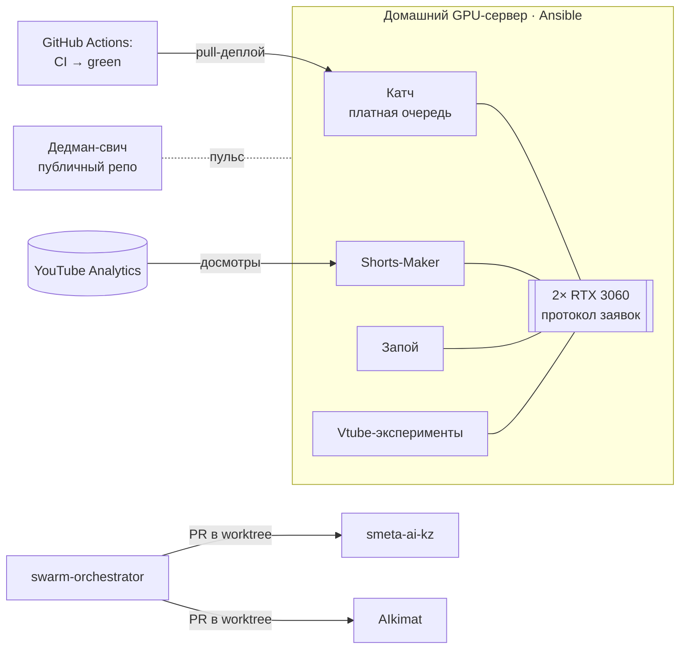

# Георгий Толкачёв · DevOps / MLOps-инженер

**Строю и эксплуатирую инфраструктуру, на которой работают LLM- и GPU-продукты:**
**от сборки сервера до автодеплоя с откатом, мониторинга и оценки качества моделей.**

---

## Коротко

- **Собрал GPU-сервер с нуля** (2× RTX 3060, Xeon, Ubuntu 26.04) и описал его Ansible-плейбуком:
  `--check --diff` против живой машины показывает `changed=0`. На нём в продакшене работают три
  сервиса.
- **CI/CD с автоматическим откатом:** тесты → ветка `green` → pull-деплой на сервере →
  healthcheck → откат на предыдущий коммит, если сервис не поднялся. Деплой не прерывает идущие рендеры.
- **Наблюдаемость без церемоний:** сторож на systemd, внешний дедман-свич на GitHub Actions,
  бэкапы 3-2-1 с шифрованием, метрики продукта (медианы, а не средние).
- **LLM в продакшене с учётом денег:** цепочка провайдеров с circuit breaker'ом, бейк-офф локальной
  модели против облачной, себестоимость ~11 ₽ за трёхчасовую запись, трёхслойная оценка качества
  LLM-отбора в CI.
- **Петля обратной связи от данных:** аналитика досмотров YouTube автоматически меняет параметры
  нарезки клипов.

## Проекты

### Сквозные кейсы: как я работаю с моделями и доставкой

| Кейс | Что внутри |
|---|---|
| **[MLOps: полный цикл модели](cases/ml-lifecycle.md)** | Датасет пишется с первого дня → бейк-офф 7 моделей на своих данных (цена отличается в ~70 раз) → версии закреплены хэшами → раздача на GPU → три слоя оценки → мониторинг стоимости → петля от аналитики → дообучение голосовой модели RVC |
| **[RAG и память](cases/rag.md)** | Гибридный поиск BGE-M3 + Qdrant (dense + sparse, RRF), трёхуровневая память ассистента, семантическая дедупликация, цитирование источников, расчёт индекса под прод |
| **[CI/CD](cases/ci-cd.md)** | Ветка `green` как контракт доставки, pull-деплой с откатом, eval-гейт LLM в CI, матрица Windows + Linux, сторож на Actions, обнаружение дрейфа Ansible |

### Инфраструктура и эксплуатация

| Проект | Что это | Ключевое |
|---|---|---|
| **[Домашний GPU-сервер](cases/gpu-server.md)** | Железо → Ansible → мониторинг → постмортемы | 8 ролей Ansible, протокол аренды GPU между проектами, расследование смертей сервера по журналу питания ноутбука |
| **[Катч — SaaS нарезки стримов](cases/katch.md)** | Telegram-сервис: VOD → вертикальные шортсы | 2 200+ тестов, pull-деплой с откатом, NVENC-бюджет, eval harness, circuit breaker |
| **[shortmaker-deadman](https://github.com/zhoratolk/shortmaker-deadman)** · публичный | Внешний сторож: пульс в gist + cron в Actions | Замерил реальную задержку cron в GitHub (медиана 163 мин) и добавил второй контур |

### ML / LLM-системы

| Проект | Что это | Ключевое |
|---|---|---|
| **[Shorts-Maker](cases/shorts-maker.md)** | Продакшен-пайплайн канала: whisper → отбор → NVENC → YouTube API | 1 260+ тестов, диаризация ≈14× быстрее реального времени, аналитика досмотров меняет конфиг |
| **[swarm-orchestrator](cases/swarm-orchestrator.md)** · [публичный](https://github.com/zhoratolk/swarm-orchestrator) | Рой LLM-агентов разных моделей | Кворум ≥3 моделей, приёмка через реальный `verify_cmd`, фильтр секретов, учёт стоимости |
| **[Запой](cases/zapoy.md)** | Локальный голосовой ассистент | llama.cpp + Qdrant + STT/TTS в compose-профилях, red-team на косвенный prompt injection |
| **[smeta-ai-kz](cases/smeta-ai-kz.md)** | AI-проверка строительных смет (кейс акселератора) | LLM отвечает только за семантику, цифры считает детерминированный код |
| **[AIkimat / RelayGov](cases/aikimat.md)** | On-premise ассистент для органа власти | LangGraph с согласованием человеком, методика расчёта GPU под продакшен |
| **[manga-shorts](cases/manga-shorts.md)** | Видеообзоры с vision-моделью | ~8K токенов на главу за счёт сеток превью вместо постраничного разбора |

### Проектирование

| Проект | Что это | Ключевое |
|---|---|---|
| **[Air-gapped AI-контур](cases/airgapped-design.md)** | Архитектура на Kubernetes + vLLM для предприятия | Спроектировал и защитил; руководство выбрало интегратора — об этом прямо сказано в кейсе |

### Приложения и прочее

| Проект | Что это |
|---|---|
| **[Dofamin Shop](cases/dofamin-shop.md)** | Android (Next.js + Capacitor): парсер маркетплейсов на устройстве, ~750 тестов |
| **[Vtube ACMT](cases/vtube-acmt.md)** | Контрибьюции через PR: авториг VTuber-модели, GPU-замеры, лицензионная разведка |
| **[Shakedown](cases/shakedown.md)** | Рогалик на Godot 4.7: 16 фаз, 650+ тестов GdUnit4 |
| **Barotrauma 40K patch** | Мод баланса: генераторы контента и валидатор на Python, сборка zip-пакета |

## Как всё связано

## Принципы, по которым я работаю

- **Проверять фактом, а не кодом возврата.** Заливка с кодом 0 однажды не залила ничего.
- **Модель — там, где нужна; код — там, где нужна точность.** Цифры сметы считает код, а не LLM.
- **Модель выбирается на своих данных.** Бейк-офф на реальной записи, а не рейтинг из блога.
- **Деплой без отката — это плановый простой.** «Протестировано» — это git-ref, а не фраза.
- **Медианы, а не средние.** Один четырёхчасовой стрим утаскивает среднее туда, где не была ни одна задача.
- **Отрицательный результат тоже записывается.** Отвергнутая локальная LLM и голосовая модель — с цифрами.
- **Писать, что сделано, а что спроектировано.** Этот README так и устроен.

## Стек — честно по уровням

| Уровень | Технологии |
|---|---|
| **Эксплуатирую сам** | Linux (Ubuntu Server), systemd, Bash, Docker / Compose, NVIDIA Container Toolkit (CDI), CUDA/NVENC, Ansible, GitHub Actions, ufw / iptables, Samba, Tailscale, SQLite, Python, faster-whisper, pyannote, ffmpeg, FastAPI, LangGraph, LLM API нескольких провайдеров, бейк-офф моделей, eval harness, llama.cpp (GGUF, GBNF), BGE-M3, Qdrant (гибридный поиск, RRF), RVC-дообучение |
| **Проектировал, не эксплуатировал** | Kubernetes + GPU Operator, vLLM, KEDA, Harbor, Qdrant в кластере, дообучение LLM на собранном датасете, Redis Streams, RabbitMQ / Celery |
| **Изучаю сейчас** | Kubernetes на практике, Terraform, Prometheus / Grafana / Loki, vLLM на своём железе |

Правило, по которому составлена таблица: технология стоит в первой строке, только если я могу три минуты
рассказывать, что с ней ломалось и как чинил.

## Постмортемы, которые стоит прочитать

- [Три «тихие» смерти сервера](cases/gpu-server.md#инциденты--постмортемы) — причина нашлась в журнале питания *ноутбука*.
- [Бесконечный цикл деплоя](cases/gpu-server.md#инциденты--постмортемы) — таймаут билда был меньше, чем холодная сборка на медленном канале.
- [Чистка облака удаляла файлы, но не строки](cases/katch.md#инциденты) — тестовая фикстура ошибалась так же, как код.
- [Харнесс нашёл баг, которого не было](cases/katch.md#оценка-качества-llm-отбора-eval-harness) — он пропускал шаг прода.

## Фрагменты кода

Код основных проектов закрыт. Вычищенные фрагменты лежат в [`snippets/`](snippets):

| Файл | Что показывает |
|---|---|
| [`deploy_agent.py`](snippets/deploy_agent.py) | Pull-деплой: проверка очереди, двойной healthcheck, откат |
| [`ci_green_branch.yml`](snippets/ci_green_branch.yml) | CI: тесты + offline-eval, fast-forward ветки `green` |
| [`gpu_pool.py`](snippets/gpu_pool.py) | Аренда GPU: заявки по mtime, выбор наименее загруженной карты |
| [`ansible_site.yml`](snippets/ansible_site.yml) · [`ansible_firewall.yml`](snippets/ansible_firewall.yml) | Сервер как код; файрвол, который не отрезает сам себя |

---

Telegram <a href="https://t.me/joparo_me">@joparo_me</a> · Санкт-Петербург · открыт к удалённой работе и переезду в Алматы · <a href="https://zhoratolk.github.io/portfolio/">сайт-портфолио</a>

