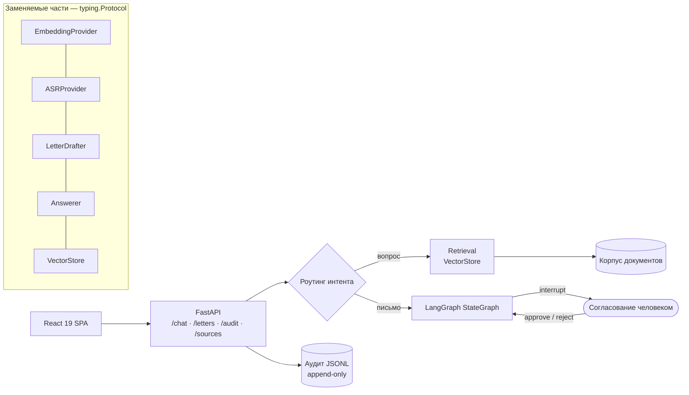

# AIkimat / RelayGov — on-premise ассистент для органа местной власти

> Прототип для акимата (Казахстан), работающий без интернета: поиск по документам с указанием
> источника, черновик ответа гражданину с обязательным согласованием человеком, поиск по
> расшифровкам совещаний, журнал аудита. Плюс методика расчёта железа под продакшен.

**Роль:** инженер в команде стартапа: бэкенд, архитектура, техническая документация, расчёт мощностей · **Статус:** прототип для демонстрации
**Стек:** FastAPI · LangGraph (`StateGraph` + `interrupt()`) · React 19 · Vite · Tailwind 4 · Recharts · pytest
**Цифры:** 45 коммитов · 76 тестов
**Код:** приватный

---

## Архитектура

- **Человек в контуре обязателен.** Письмо гражданину не уходит без согласования: граф
  останавливается на `interrupt()` и ждёт `approve` или `reject`.
- **Все модели — за интерфейсами** (`typing.Protocol`). Заглушку заменяют на vLLM или
  faster-whisper, не трогая логику.
- **Портативный офлайн-запуск:** embeddable Python 3.13 и Node лежат внутри пакета, на целевой
  машине ничего не устанавливается. Одна команда запускает демо без сети.
- Пагинация `/audit` с обратной совместимостью и настраиваемый `topK` написаны роем
  [swarm-orchestrator](swarm-orchestrator.md).

## Расчёт мощностей под продакшен

Раздел технической документации — методика закупки, а не цифра, взятая с потолка:

- VRAM ≈ параметры × байт на параметр (FP16 / INT8 / INT4) плюс 20–30 % на KV-кэш при
  параллельных запросах. Для казахского языка квантование ниже INT8 нужно проверять на реальных
  ответах.
- ASR (класс large-v3): 8–10 ГБ VRAM в пакетном режиме. Для расшифровки в реальном времени нужна
  отдельная карта, не общая с LLM.
- Хранилище — не узкое место: 10 000 документов ≈ 30 000 чанков ≈ 120 МБ векторов + HNSW-индекс.
- Пик: 200 активных пользователей × 5–10 % одновременности = 10–20 генераций, закладывается ×2.
  Отсюда три уровня закупки (пилот / весь акимат / тиражирование) и нагрузочный тест на пилоте до
  закупки второго уровня.
- Путь в прод: uvicorn/gunicorn за reverse proxy; pgvector или Qdrant вместо in-memory хранилища;
  персистентный чекпоинтер LangGraph; аудит в Postgres; vLLM на отдельном GPU-узле; метрики
  Prometheus и алерт на зависшие согласования.

## Честные ограничения

Документированы в самом проекте: LLM и ASR пока заглушки; эмбеддинги лексические (хэши
триграмм); векторный поиск линейный и в памяти; нет авторизации, ролей и OCR. Реальный модельный
слой ждёт бюджета, лицензии модели и реального корпуса документов.
