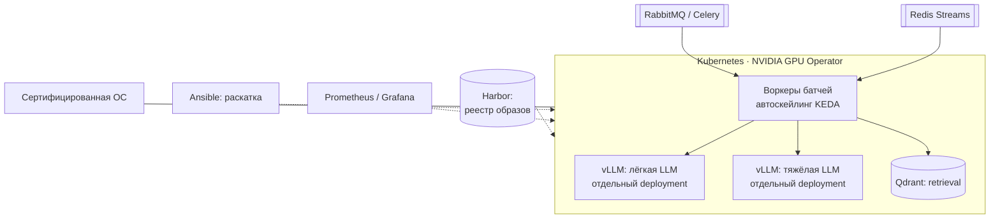

# Архитектура автономного (air-gapped) AI-контура — проектная работа

> Инициативная предпроектная проработка на предприятии аэрокосмической отрасли: автономная
> AI-система для работы с технической документацией. Архитектуру я спроектировал и защитил перед
> руководством. **До внедрения она не дошла:** руководство выбрало готовое решение интегратора.

**Роль:** инициатор, архитектор, автор технического задания · **Статус:** проект защищён, внедрение не велось
**Что это за опыт:** проектирование, расчёт и защита решения. В эксплуатации этой системы у меня опыта нет

---

## Задача

Нормоконтроль документации по отраслевым стандартам (ГОСТ / ОСТ / СТП), генерация документов,
разбор переписки с учётом ролей доступа. Контур без выхода в интернет. Задачи такой в работе не
было — идею и обоснование я внёс сам.

## Предложенная архитектура

- Две модели разного размера — отдельные deployment'ы vLLM: дешёвая модель обрабатывает массовые
  запросы, тяжёлая — только те, где без неё падает качество.
- Кластер из GPU- и CPU-узлов: подбор серверов и видеокарт, оценка памяти под модели, топология
  PCIe и NUMA, схема виртуализации с пробросом GPU.
- Сравнение «строить самим или покупать»: у своего решения — контроль и стоимость владения, у
  интегратора — сроки и поддержка. Руководство выбрало второе. Это нормальный корпоративный выбор.

## Что было дальше

Тот же расчёт я проверил за свои деньги в урезанном виде: GPU-узел без CPU-части. Собрал
[домашний GPU-сервер](gpu-server.md) и довёл его до работающего сервиса с очередью, автодеплоем
с откатом, мониторингом и бэкапами.

*Детали, относящиеся к предприятию, намеренно не раскрываются.*
