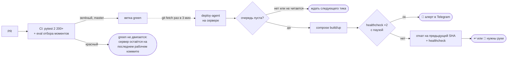

# CI/CD: от «протестировано» как фразы к «протестировано» как git-ref

> Сводный кейс по всем пайплайнам: pull-деплой с автоматическим откатом, eval-гейт для LLM в CI,
> кроссплатформенная матрица, поиск секретов, внешний сторож на расписании, дрейф конфигурации
> сервера и CI самого этого портфолио.

**Проекты:** [Катч](katch.md) · [Shorts-Maker](shorts-maker.md) · [shortmaker-deadman](https://github.com/zhoratolk/shortmaker-deadman) · [домашний GPU-сервер](gpu-server.md) · это портфолио
**Стек:** GitHub Actions · systemd timers · Docker Compose · Ansible · gitleaks · lychee · html-validate · pytest

---

## Катч: доставка без присмотра

- **Работа через PR.** Ветка → PR → CI → мерж `--rebase` после зелёного. Прямых пушей в master нет,
  auto-merge не включается.
- **LLM в CI как обычный код.** Инварианты отбора моментов и сравнение с baseline идут в том же
  пайплайне, что и юнит-тесты: без API, за секунду, на закоммиченных фикстурах. Реальный корпус —
  пользовательские данные, он с сервера не уходит. Дрейф результата — красная сборка, а не
  предупреждение в логе, которое никто не читает.
- **`green` — единственный канал доставки.** CI двигает её fast-forward'ом и только на master. Если
  push не fast-forward, это красный прогон, а не `--force`: значит, `green` ушла вперёд master.
- **Pull-модель.** На сервере нет токена, вебхука и открытого порта. Ему достаточно уметь
  `git fetch`.
- **Параметры выбраны по фактам.** Python в CI — тот же 3.12, что в Dockerfile. У каждого теста
  `--timeout` и `--durations`: первый прогон CI убили на 20-й минуте без единой строки вывода, а
  локально набор шёл 61 секунду. `concurrency` с отменой устаревших прогонов. ffmpeg ставится в
  раннер, потому что часть тестов проверяет, что собранную команду принимает настоящий ffprobe.
- **Деплой-агент покрыт тестами** как обычный код: раннер команд, healthcheck и часы подменяются
  через аргументы. Фрагмент — [`snippets/deploy_agent.py`](../snippets/deploy_agent.py).

## Shorts-Maker: матрица Windows + Linux

Пайплайн работает и на десктопе под Windows, и на сервере под Linux, поэтому тесты идут матрицей
`ubuntu-latest` × `windows-latest` с `fail-fast: false`. Медленные smoke-тесты с настоящим ffmpeg
помечены маркером `integration` и в CI не входят. Второй job — gitleaks по всей истории.

## shortmaker-deadman: CI как внешний мониторинг

Workflow по расписанию (`*/15`) читает пульс сервера из секретного gist и пишет в Telegram при смене
состояния. Состояние коммитится в репозиторий, чтобы алерт уходил один раз, а не каждые 15 минут.
`concurrency` без отмены, чтобы два прогона не затёрли `state.json` друг другу.

Замер показал, что cron в GitHub Actions опаздывает: медиана 163 минуты, максимум 342. Вывод:
расписание Actions — это «когда-нибудь», а не «каждые 15 минут». Поэтому быстрый второй контур
стоит на ноутбуке. Анонимное чтение gist ловило 403 от общего лимита по IP раннеров — переведено
на токен в секретах.

## Сервер: обнаружение дрейфа конфигурации

`ansible-playbook site.yml --check --diff` против живого сервера — это проверка дрейфа: `changed=0`
значит, что описание совпадает с машиной. Роли покрыты тестами по разобранному YAML. Плейбук
отказывается запускаться против чего-либо, кроме Ubuntu 26+.

## Это портфолио

Четыре job'а на каждый пуш:

- gitleaks-CLI по всей истории. `gitleaks-action` сканирует диапазон `первый^..последний` пуша и
  на первом пуше ветки падает с «unknown revision», ничего не просканировав. Поймал на первом же
  прогоне и заменил;
- офлайн-проверка ссылок и якорей (lychee);
- валидность HTML и парсинг JS;
- сверка структуры русской и английской версий каждого кейса ([`tools/check_translation.py`](../tools/check_translation.py)):
  заголовки, диаграммы, блоки кода и строки таблиц должны совпадать, чтобы языки не разъехались.

Сайт публикуется в GitHub Pages отдельным workflow без шага сборки: что лежит в репозитории, то и
отдаётся.

## Принципы, которые из этого выросли

- «Протестировано» — это git-ref, а не фраза в сообщении коммита.
- Деплой без отката — это плановый простой.
- Healthcheck проверяет «поднялось и держится», а не «команда вернула 0».
- Таймауты выставляются по худшему наблюдённому случаю, а не круглым числом.
- Проверять результат фактом, а не кодом возврата: заливка с кодом 0 однажды не залила ничего.
