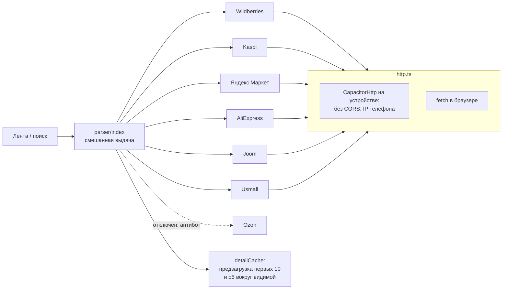

# Dofamin Shop — Android-приложение с живым парсером маркетплейсов прямо на устройстве

> Мобильная витрина, которая собирает товары с нескольких маркетплейсов прямо с телефона, без
> своего бэкенда: смешанная лента, карточка с фото и отзывами, корзина, «оформление» с анимацией
> оплаты, трекинг курьера на карте.

**Роль:** разработка в рамках e-commerce направления стартапа · **Статус:** рабочая сборка под Android
**Стек:** Next.js 16 (static export) · React 19 · Capacitor 8 · TypeScript · Vitest 4 (+ coverage v8) · Leaflet + OSM · OSRM · Nominatim
**Цифры:** 180 коммитов · ~750 тестов Vitest
**Код:** приватный

---

## Архитектура парсера

- **Без сервера.** Запросы идут с телефона через `CapacitorHttp`: нет CORS, у запроса IP обычного
  пользователя. План на серверный прокси описан отдельно, на случай если это перестанет работать.
- **Адаптивный перебор версий API Wildberries** (v5/v4/v9/v13/v8/v2) с кэшем рабочей версии —
  публичные эндпоинты меняются без предупреждения.
- **Мультивалютность по магазину:** цены Kaspi в тенге, для Kaspi обязателен `Referer`.
- **Ozon отключён честно.** Антибот (Qrator) не обходится с устройства, и витрина его не имитирует.
- Яндекс Маркет разбирается через JSON-LD из HTML.

## Продуктовые решения

- **Лента append-only.** Раньше фоновое обновление переставляло карточки под пальцем.
- **Выбор цвета удалён.** Данных о цветах нет, а выбор был фейковым. Размеры показываются только
  там, где они реально бывают (обувь 36–45, одежда S–XL), по белому списку категорий.
- **История заказов нормализуется при гидрации.** В `localStorage` могут лежать записи старее
  текущей схемы — они приводятся к ней, а не кастятся через `as`.
- Дизайн-токены цвета, тёмная тема без мигания при старте, анимации оплаты и распаковки заказа.

## Процесс

Каждое изменение заканчивается одной командой `npm run android:sync` (`next build` + `cap sync`):
сборка сразу готова к запуску в Android Studio.
