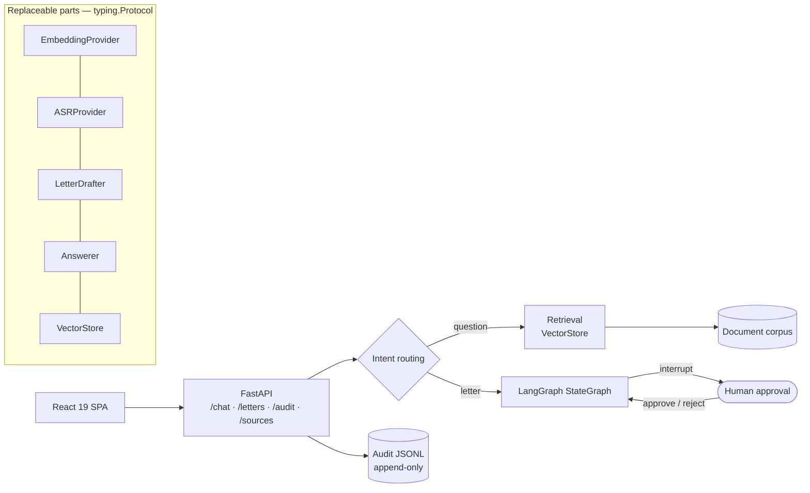

# AIkimat / RelayGov — an on-prem assistant for a local government office

> A prototype for an akimat (local government office, Kazakhstan) that works without internet:
> document search with source citations, a draft reply to a citizen with mandatory human approval,
> search over meeting transcripts, an audit log. Plus a method for sizing hardware for production.

**Role:** engineer on a startup team: backend, architecture, technical documentation, capacity planning · **Status:** demo prototype
**Stack:** FastAPI · LangGraph (`StateGraph` + `interrupt()`) · React 19 · Vite · Tailwind 4 · Recharts · pytest
**Numbers:** 45 commits · 76 tests
**Code:** private

---

## Architecture

- **A human in the loop is mandatory.** A letter to a citizen does not go out without approval: the
  graph stops at `interrupt()` and waits for `approve` or `reject`.
- **Every model sits behind an interface** (`typing.Protocol`). A stub is replaced with vLLM or
  faster-whisper without touching the logic.
- **Portable offline launch:** embeddable Python 3.13 and Node ship inside the package; nothing is
  installed on the target machine. One command starts the demo with no network.
- `/audit` pagination with backward compatibility and a configurable `topK` were written by the
  swarm [swarm-orchestrator](swarm-orchestrator.md).

## Capacity planning for production

A section of the technical documentation — a purchasing method, not a number pulled from thin air:

- VRAM ≈ parameters × bytes per parameter (FP16 / INT8 / INT4) plus 20–30 % for the KV cache under
  concurrent requests. For Kazakh, quantization below INT8 has to be checked on real answers.
- ASR (large-v3 class): 8–10 GB VRAM in batch mode. Real-time transcription needs a separate card,
  not one shared with the LLM.
- Storage is not a bottleneck: 10,000 documents ≈ 30,000 chunks ≈ 120 MB of vectors + an HNSW index.
- Peak: 200 active users × 5–10 % concurrency = 10–20 generations, planned at ×2. Hence three
  purchase tiers (pilot / whole akimat / roll-out) and a load test on the pilot before buying the
  second tier.
- Path to production: uvicorn/gunicorn behind a reverse proxy; pgvector or Qdrant instead of the
  in-memory store; a persistent LangGraph checkpointer; audit in Postgres; vLLM on a separate GPU
  node; Prometheus metrics and an alert on stuck approvals.

## Honest limitations

Documented in the project itself: the LLM and ASR are stubs for now; embeddings are lexical (trigram
hashes); vector search is linear and in memory; there is no authentication, no roles and no OCR. The
real model layer is waiting for a budget, a model licence and a real document corpus.
