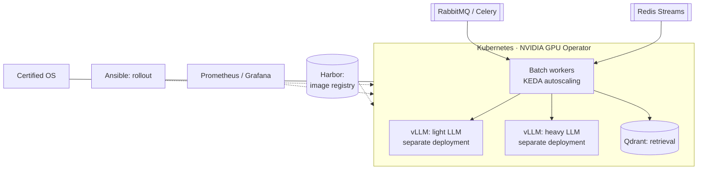

# Architecture of an air-gapped AI platform — design work

> A self-initiated pre-project study at an aerospace enterprise: an autonomous AI system for working
> with technical documentation. I designed the architecture and defended it in front of leadership.
> **It was never deployed:** leadership chose an integrator's off-the-shelf solution.

**Role:** initiator, architect, author of the technical specification · **Status:** design defended, no deployment
**What kind of experience this is:** designing, sizing and defending a solution. I have no experience operating this system

---

## The problem

Compliance checking of documentation against industry standards (GOST / OST / STP), document
generation, analysis of correspondence with access roles taken into account. An environment with no
internet access. Nobody had assigned this task — I brought in the idea and the justification myself.

## The proposed architecture

- Two models of different sizes as separate vLLM deployments: the cheap model handles bulk requests,
  the heavy one only those where quality drops without it.
- A cluster of GPU and CPU nodes: choosing servers and graphics cards, estimating memory for the
  models, PCIe and NUMA topology, a virtualization scheme with GPU passthrough.
- A "build or buy" comparison: our own solution offered control and cost of ownership, the
  integrator offered timelines and support. Leadership chose the latter. That is a normal corporate
  decision.

## What happened next

I tested the same sizing with my own money in a reduced form: a GPU node without the CPU part. I built
a [home GPU server](gpu-server.md) and brought it to a working service with a queue, auto-deploy with
rollback, monitoring and backups.

*Details specific to the enterprise are deliberately not disclosed.*
