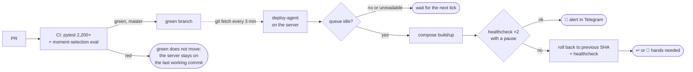

# CI/CD: from "tested" as a phrase to "tested" as a git ref

> A cross-project case study of every pipeline: a pull-based deploy with automatic rollback, an eval
> gate for the LLM in CI, a cross-platform matrix, secret scanning, an external watchdog on a
> schedule, server configuration drift, and the CI of this very portfolio.

**Projects:** [Katch](katch.md) · [Shorts-Maker](shorts-maker.md) · [shortmaker-deadman](https://github.com/zhoratolk/shortmaker-deadman) · [home GPU server](gpu-server.md) · this portfolio
**Stack:** GitHub Actions · systemd timers · Docker Compose · Ansible · gitleaks · lychee · html-validate · pytest

---

## Katch: unattended delivery

- **Work through PRs.** Branch → PR → CI → merge with `--rebase` after green. No direct pushes to
  master, auto-merge is never enabled.
- **The LLM in CI like ordinary code.** Moment-selection invariants and the baseline comparison run
  in the same pipeline as unit tests: no API, in a second, on committed fixtures. The real corpus is
  user data and never leaves the server. A drifted result is a red build, not a warning in a log
  nobody reads.
- **`green` is the only delivery channel.** CI moves it by fast-forward and only on master. If the
  push is not a fast-forward, that is a red run, not `--force`: it means `green` got ahead of master.
- **Pull model.** The server has no token, no webhook and no open port. All it needs is `git fetch`.
- **Parameters chosen from facts.** Python in CI is the same 3.12 as in the Dockerfile. Every test
  has `--timeout` and `--durations`: the first CI run was killed at minute 20 without a single line
  of output, while the suite took 61 seconds locally. `concurrency` cancels stale runs. ffmpeg is
  installed in the runner because some tests check that a real ffprobe accepts the command we build.
- **The deploy agent is covered by tests** like any other code: the command runner, the healthcheck
  and the clock are injected through arguments. Excerpt — [`snippets/deploy_agent.py`](../../snippets/deploy_agent.py).

## Shorts-Maker: a Windows + Linux matrix

The pipeline runs both on a Windows desktop and on a Linux server, so tests run as a matrix of
`ubuntu-latest` × `windows-latest` with `fail-fast: false`. Slow smoke tests with a real ffmpeg are
tagged with the `integration` marker and are left out of CI. The second job is gitleaks over the
whole history.

## shortmaker-deadman: CI as external monitoring

A scheduled workflow (`*/15`) reads the server's heartbeat from a secret gist and messages Telegram
when the state changes. The state is committed to the repository so the alert fires once rather than
every 15 minutes. `concurrency` without cancellation, so two runs cannot overwrite each other's
`state.json`.

Measurement showed that GitHub Actions cron runs late: median 163 minutes, maximum 342. The
conclusion: an Actions schedule means "at some point", not "every 15 minutes". That is why a fast
second loop runs on the laptop. Anonymous gist reads hit 403 from the shared rate limit of runner
IPs — switched to a token in secrets.

## Server: configuration drift detection

`ansible-playbook site.yml --check --diff` against the live server is a drift check: `changed=0`
means the description matches the machine. The roles are covered by tests over the parsed YAML. The
playbook refuses to run against anything but Ubuntu 26+.

## This portfolio

Four jobs on every push:

- the gitleaks CLI over the whole history. `gitleaks-action` scans the push range `first^..last`
  and on the first push of a branch fails with "unknown revision" without scanning anything. Caught
  on the very first run and replaced;
- offline link and anchor checking (lychee);
- HTML validity and JS parsing;
- a structure comparison of the Russian and English version of each case study ([`tools/check_translation.py`](../../tools/check_translation.py)):
  headings, diagrams, code blocks and table rows must match so the languages cannot drift apart.

The site is published to GitHub Pages by a separate workflow with no build step: what is in the
repository is exactly what gets served.

## Principles that grew out of this

- "Tested" is a git ref, not a phrase in a commit message.
- A deploy without rollback is a scheduled outage.
- A healthcheck verifies "came up and stays up", not "the command returned 0".
- Timeouts are set from the worst observed case, not as a round number.
- Check the result by fact, not by exit code: an upload with exit code 0 once uploaded nothing.
