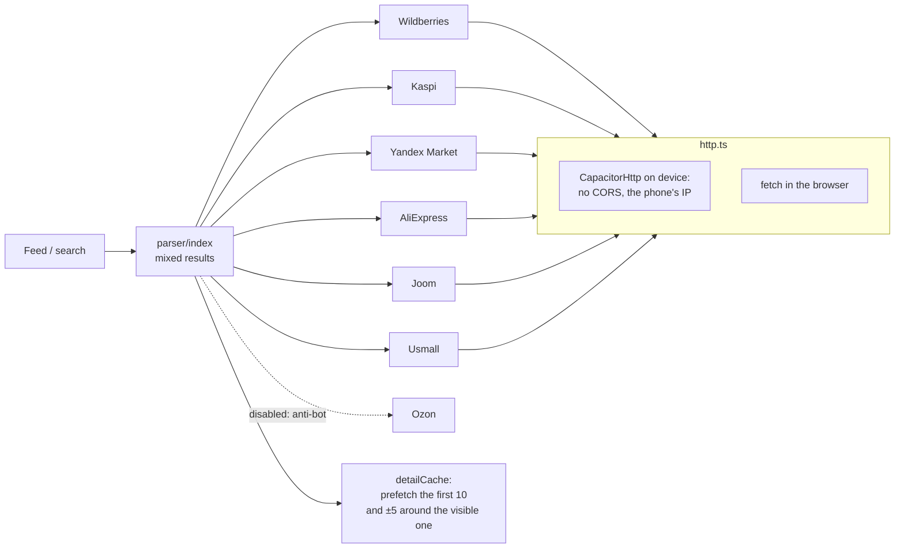

# Dofamin Shop — an Android app with a live marketplace parser running on the device

> A mobile storefront that collects products from several marketplaces directly from the phone, with
> no backend of its own: a mixed feed, a product card with photos and reviews, a cart, a "checkout"
> with a payment animation, courier tracking on a map.

**Role:** development within the startup's e-commerce track · **Status:** working Android build
**Stack:** Next.js 16 (static export) · React 19 · Capacitor 8 · TypeScript · Vitest 4 (+ coverage v8) · Leaflet + OSM · OSRM · Nominatim
**Numbers:** 180 commits · ~750 Vitest tests
**Code:** private

---

## Parser architecture

- **No server.** Requests go from the phone through `CapacitorHttp`: no CORS, and the request comes
  from an ordinary user's IP. A plan for a server-side proxy is written up separately, in case this
  stops working.
- **Adaptive probing of Wildberries API versions** (v5/v4/v9/v13/v8/v2) with a cache of the working
  one — public endpoints change without notice.
- **Per-store currency:** Kaspi prices are in tenge, and Kaspi requires a `Referer`.
- **Ozon disabled honestly.** Its anti-bot (Qrator) cannot be passed from the device, and the
  storefront does not fake it.
- Yandex Market is parsed via JSON-LD from the HTML.

## Product decisions

- **An append-only feed.** Background refreshes used to reshuffle cards under the user's finger.
- **Colour selection removed.** There is no colour data, and the picker was fake. Sizes are shown only
  where they actually exist (shoes 36–45, clothing S–XL), via a whitelist of categories.
- **Order history is normalized on hydration.** `localStorage` may hold records older than the
  current schema — they are brought up to it rather than cast with `as`.
- Colour design tokens, a dark theme without a flash on startup, payment and unboxing animations.

## Process

Every change ends with one command, `npm run android:sync` (`next build` + `cap sync`): the build is
immediately ready to run in Android Studio.
