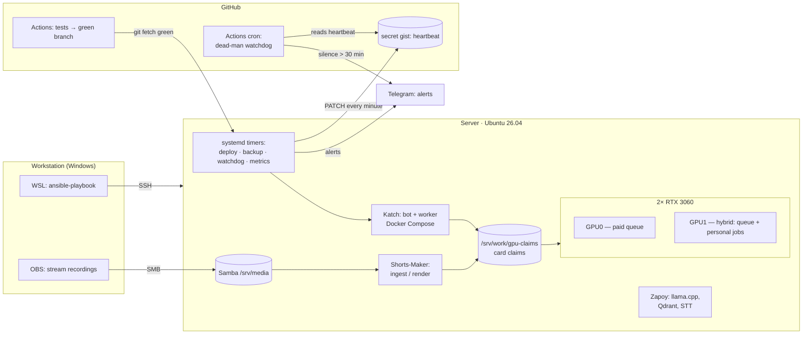

# Home GPU server: from buying hardware to infrastructure as code

> A server with two RTX 3060s that runs three services in production. It is described by an Ansible
> playbook, deploys itself, and reports its own death through an external watchdog on GitHub Actions.

**Role:** design, purchasing, assembly, operations · **Status:** running since 25.08.2026
**Stack:** Ubuntu Server 26.04 · NVIDIA driver 595 · Docker 29 · NVIDIA Container Toolkit (CDI) · Ansible · ufw · systemd · Samba · Tailscale · GitHub Actions
**Code:** private; excerpts — [`snippets/ansible_site.yml`](../../snippets/ansible_site.yml), [`snippets/ansible_firewall.yml`](../../snippets/ansible_firewall.yml), [`snippets/gpu_pool.py`](../../snippets/gpu_pool.py); the watchdog is public — [zhoratolk/shortmaker-deadman](https://github.com/zhoratolk/shortmaker-deadman)

---

## The problem

I needed a machine for GPU workloads: transcription (faster-whisper large-v3), diarization (pyannote)
and NVENC video rendering for a paid service and a personal pipeline. Cloud GPUs for this load cost
more per month than the server itself. Constraints: a home-server budget, a flat without a UPS, and a
slow, unstable uplink.

## Hardware — sized before buying

| Component | Choice | Why |
|---|---|---|
| Motherboard | Huananzhi X99-F8 | 2× PCIe x16 for two cards; the second M.2 is PCIe 2.0, accounted for before purchase |
| CPU | Xeon E5-2697 v4, 18C/36T | threads for parallel ffmpeg and CPU filters, 145 W |
| RAM | 32 GB DDR4 ECC Reg, 4×8 | all four channels populated |
| GPU | 2× RTX 3060 12 GB | 12 GB VRAM per card — large-v3 in float16 (~5 GB) plus rendering with headroom |
| Disks | NVMe 512 GB (system, LVM) + NVMe 1 TB (`/srv/work`) | OS kept apart from working data |
| PSU | 750 W | ~545 W under load with two cards, ~100 W idle |

An RTX 4060 Ti 16 GB was considered and rejected: for the same money two 3060s give two NVENC chips
and twice the SMs, and the workload parallelises per card without NVLink.

## Architecture

## Engineering decisions

**Server as code.** For three weeks the server existed as a series of commands in a chat history.
Then it was written down as an Ansible playbook with eight roles (`base`, `network`, `storage`,
`docker`, `gpu`, `samba`, `ops`, `firewall`). The test of truth: `ansible-playbook site.yml --check
--diff` against the live server reports `changed=0`. The roles are covered by tests over the parsed
YAML. The playbook does not write secrets (env files are created empty and filled interactively),
does not format disks (it only mounts them), and does not restart the application — that is the
deploy agent's job.

**A firewall that cannot lock itself out.** Rules come first, the `deny` policy is the last task and
only runs behind the `firewall_enabled` flag. Otherwise a run over SSH cuts itself off halfway.
Tailscale got its own analysis: without a rule for `41641/udp` it silently falls back to a DERP
relay, with no errors in the logs. The router's IGMP query noise (≈4,000 lines a day in the kernel
log) is dropped before the logging chain.

**Two cards, two projects, no shared scheduler.** The paid queue and the personal pipeline are
separate repositories with no shared code. The claim protocol: a file `/srv/work/gpu-claims/gpu<N>`,
freshness judged by `mtime` (touched every 30 s, stale after 120 s). A holder that dies halfway
cannot leave a lock that lives forever. If every card is claimed, the claims are ignored: a claim is
a request, not a lock, and paid work must not stall. The worst case is a slowdown, not an outage.

**Network changes over SSH only with a rollback timer.** `systemd-run --on-active=300` restores the
netplan backup unless it is cancelled by hand after checking.

## Monitoring and survivability

- **On-host watchdog** (`watchdog.py`, systemd): service, mount points, GPU; alerts go to a separate
  send-only Telegram bot. Its token lives only in a root-only env file (`600`).
- **External dead-man switch.** A dead server sends nothing, and silence looks exactly like health.
  So the server writes `<epoch> ok|fail` to a secret gist every minute, and a public repository
  checks every 15 minutes how stale that record is. Measurement showed that GitHub Actions cron runs
  late: median 163 min, maximum 342 min. So a second, fast watchdog was added on the laptop (a
  scheduled task every 5 minutes). External services (healthchecks.io, Better Stack) did not work
  out: sign-up never went through.
- **3-2-1 backups** with encryption; the passphrase is kept only off the machine; restores are
  verified by unpacking, not by an exit code.
- A post-boot message, a weekly metrics digest, Wake-on-LAN.

## Incidents — postmortems

| Symptom | Cause | Fix |
|---|---|---|
| Three "silent" deaths in a week: the journal stops mid-line, no panic, no MCE, no OOM | Power sags in the flat. Found via the **laptop's** power log: 92 switches to battery in two days, two of them matching the server deaths to the second | Rule: an unexplained crash — check the power log first; a UPS is planned |
| After a power cut the server does not come back up | `Restore AC Power Loss = Power Off` since the build | `Last State` in BIOS |
| The image build does not fit in an hour → endless loop of "kill on timeout → roll back → build again" | After `docker builder prune -a` the torch+CUDA layer (~4 GB) re-downloaded over a slow link | pip cache mount in the Dockerfile, `BUILD_TIMEOUT` of 4 h = the worst cold build observed, not a round number |
| `NVIDIA_DRIVER_CAPABILITIES` has no effect | Toolkit 1.20 + Docker 29 run through CDI, and CDI does not read this variable | The variable is kept as insurance for the legacy runtime; a test keeps the Dockerfile and compose in agreement |
| Container ports reachable past ufw | The `DOCKER` chain comes before `INPUT` | Publish ports on a specific address / `DOCKER-USER` |
| Network "up, then down" after an outage | The cable: `Lost carrier / Gained carrier` every few seconds | Static address via the `network` role, diagnosis with `journalctl -u systemd-networkd` |

## What's next

A UPS with NUT over USB; a MAC-based address reservation on the router; a Prometheus/Grafana
dashboard on top of the existing textfile metrics export.
