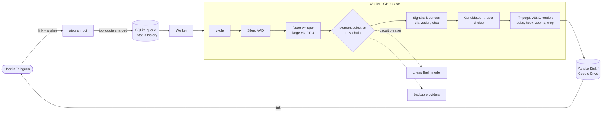
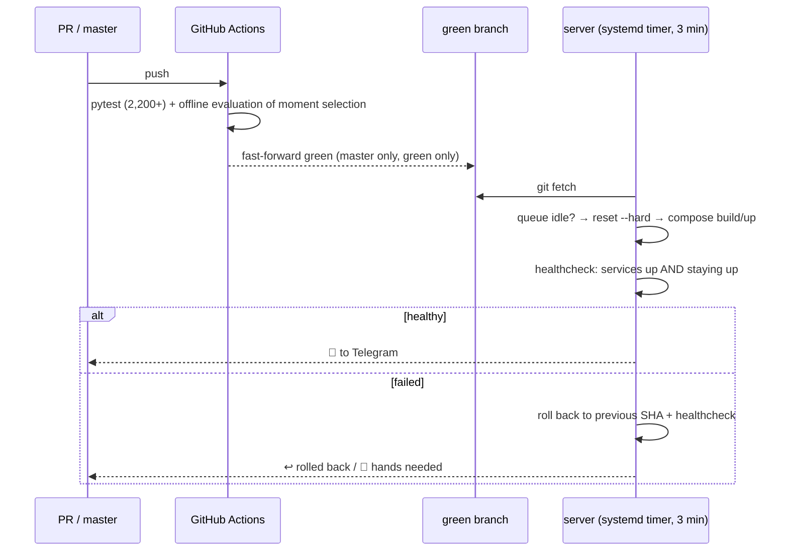

# Katch — a stream-clipping SaaS on a GPU server

> A Telegram service for Russian-speaking streamers: send a link to a stream recording, get vertical
> 9:16 shorts with subtitles, hooks and metadata. The full cycle from link to finished clip, CI/CD
> with automatic rollback, quality evaluation of LLM moment selection, and cost accounting per job.

**Role:** owner of the product and the infrastructure: architecture, operations, product decisions · **Status:** closed beta
**Stack:** Python 3.12 · aiogram · SQLite · Docker Compose · faster-whisper large-v3 · Silero VAD · pyannote 3.1 · ffmpeg/NVENC · several LLM providers with fallback · GitHub Actions · systemd
**Numbers:** 290+ commits · 2,200+ tests · ~11 ₽ (RUB) cost to process a three-hour recording
**Code:** private; excerpts — [`snippets/deploy_agent.py`](../../snippets/deploy_agent.py), [`snippets/ci_green_branch.yml`](../../snippets/ci_green_branch.yml), [`snippets/gpu_pool.py`](../../snippets/gpu_pool.py)

---

## Pipeline

The job state machine: downloading → transcribing → finding moments → awaiting selection →
rendering → delivered → cleaned up. The source (4–8 GB) is deleted after processing. Finished clips
live for 48 hours, and the local file is deleted **only after a confirmed upload to the cloud**. If
the upload still fails after retries, the clip goes to quarantine on a separate volume instead of
disappearing.

## CI/CD: "tested" is a git ref, not words in a commit

- The server pulls changes itself (pull model): no token, no webhook, no open port. All it needs is
  `git fetch`.
- A deploy does not start while a render is in the queue. If the queue cannot be read, the deploy
  does not start either: deploying late is better than killing someone's render.
- The healthcheck polls the services twice with a pause. A container in a crash loop passes
  `up -d` successfully and dies a second later, so one check is not enough.
- Rollback is what lets the deploy run unattended. A deploy without rollback turns into a scheduled
  outage.
- `BUILD_TIMEOUT` = 4 h is chosen from the worst cold build observed. With a one-hour timeout a
  build on a slow link was killed, rolled back and restarted every 60 minutes.

## GPU: explicit placement, not "it'll sort itself out"

`worker/gpu_pool.py`: `lease()` hands out the index of the least-loaded card. Through a `ContextVar`
it reaches ffmpeg (`-hwaccel_device`, `-gpu`), faster-whisper (`device_index`) and pyannote
(`cuda:N`). Without it all four libraries silently take card 0 and the second card sits idle. From
the calculations:

- **The parallelism ceiling is NVENC sessions, not memory.** The driver limit is 8 sessions per
  system, not per card. The budget in code is 6, with headroom. When it is exceeded, rendering
  quietly falls back to libx264, so it has to be checked by fact, not by symptoms.
- Two transcriptions on one card barely speed anything up: they share the same SMs. Transcribing one
  job and rendering another overlap almost for free, because rendering uses NVDEC/NVENC and the CPU.
- Models are pinned by revision hash (whisper large-v3, pyannote 3.1), weights sit on a named volume
  so they are not downloaded on every deploy.

## LLM: economics and reliability

- **A provider chain with a circuit breaker per provider.** Cheap flash models go first; the
  expensive one is used where quality drops without it. An empty model answer counts as a failure
  just like a dead endpoint.
- **A bake-off of a local LLM against a cloud one.** `qwen3-32b` on these cards cut the moment off
  before the punchline, while the cloud flash-lite costs ~$0.06 per recording. Self-hosting does not
  pay off; the decision is recorded together with the numbers.
- **Cost guard:** cost is counted per stage and per actual model, not with one price for everything.
- **Unit cost (measured):** ~11 ₽ per three-hour recording, of which the LLM is ≈ $0.03 per hour and
  the rest is electricity.

## Quality evaluation of LLM selection (eval harness)

When you change a prompt, you cannot tell whether things got better or worse. Unit tests check that
the function returned a list, not that the moments in it are good. There are no labels: 248
delivered clips, not a single rejected candidate. So evaluation is split into three layers, and the
layer names prevent passing one off as another:

1. **Invariants** (in CI on every push, no API, ~1 s): the window is inside the recording, the
   duration is within bounds, the hook quote is actually spoken in that window, no duplicates, the
   ranking is ordered, "repair" is idempotent, the result does not depend on the order of the model's
   answer.
2. **Baseline:** the same corpus through the same code, compared with a frozen result. Drift is a
   build error. A new result can only be accepted with a separate flag.
3. **Quality** (recall@k, boundary IoU): blocked until labels exist. Raw model answers are already
   written to a separate column so there will be something to compute labels against.

The lesson from the first run: the harness found a "bug" that wasn't there. It skipped the
`drop_overlapping` step that prod runs. The rule since then: **the harness mirrors prod step by
step** and imports functions from the pipeline instead of copying them.

## Metrics

Six numbers instead of a dashboard: time to the list of moments per hour of recording, the share
spent waiting in the queue, the stage where jobs stop, the fallback share per provider, cost per job
(median and p90), and how many users never came back to choose their moments. Medians, not averages.
The source is `job_events` in SQLite. An export in node_exporter textfile-collector format already
exists; Grafana is deliberately postponed: with a dozen jobs a day, two extra containers for the same
six numbers is ceremony.

## Incidents

- **Cloud cleanup deleted files but not database rows.** The parser expected `<id>.mp4`, while the
  real names were `"<title> (<id>).mp4"`. The test fixture was wrong in the same way as the code, so
  the test was green. 126 rows pointed at deleted files → 65 after the fix, exactly the number of
  live ones.
- **The punch zoom cut off a fifth of the clip:** `zoompan d=1` with `fps=60` on a 30 fps source made
  the video shorter than the audio.
- **An audit of the business logic found six holes:** the monthly quota was not reset; the cost guard
  did not count the expensive stage; the quota was not refunded when a job failed; abandoned jobs
  held 4–8 GB on disk indefinitely. Now the deadline depends on the plan, and reminders come every
  3 hours, at most four times.
- **SQLite `CURRENT_TIMESTAMP` has one-second precision.** A job created in the same second is not
  "older than now".

## Honest limitations

Payments are not connected, there are no paying users yet, the beta runs on friends. The queue is
SQLite: enough for the current load; the plan for growth is Redis/RabbitMQ. Selection quality
metrics are waiting for labels.
