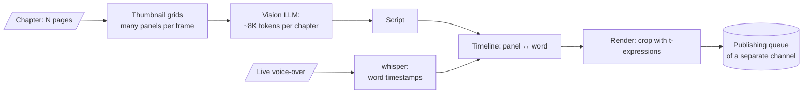

# manga-shorts — video reviews with a vision model on a token budget

> A webtoon video-review pipeline for a second channel: chapters and the author's live voice-over →
> panel analysis → script → timeline from word-level timestamps → rendering with smooth camera moves
> across each panel → metadata → publishing queue.

**Role:** author · **Status:** all 5 phases built, awaiting an end-to-end run on a real episode
**Stack:** Python · vision LLM · faster-whisper (word timestamps) · ffmpeg · YouTube Data API
**Numbers:** 37 tests
**Code:** private

---

## The key decision: the vision model looks at thumbnail grids, not at every page

- **The token budget is a hard contract:** ~8K tokens per chapter thanks to thumbnail grids.
  Page-by-page analysis would cost several times more.
- **Camera motion** is `crop` with time-based expressions, not `zoompan`: `zoompan` jitters due to
  sub-pixel positioning.
- **TTS rejected** — the voice-over is live; the author's voice is the product.
- **Isolation:** its own `mshorts/` package (the name `scripts/` would shadow the neighbouring
  installed pipeline) and separate publishing queues for the second channel.
- Hygiene rules: manga pages are never committed, and the title is never named in the history.
