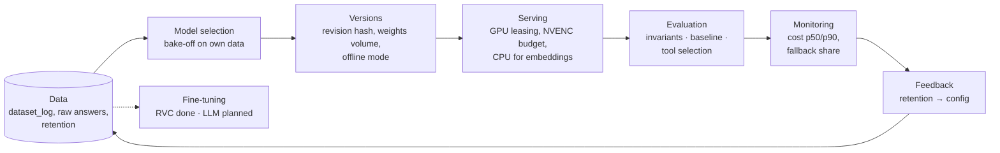

# MLOps: the full model lifecycle across my projects

> A cross-project case study: how models travel from data to production and back. Choosing a model
> on my own data, pinning versions, serving on GPUs, quality evaluation, cost monitoring, feedback
> loops and fine-tuning. Every item comes from a working project, not from a textbook.

**Projects:** [Katch](katch.md) · [Shorts-Maker](shorts-maker.md) · [Zapoy](zapoy.md) · [manga-shorts](manga-shorts.md) · [home GPU server](gpu-server.md)
**Stack:** faster-whisper · pyannote · llama.cpp (GGUF, GBNF) · BGE-M3 · Qdrant · RVC (HiFi-GAN) · OpenRouter · GitHub Actions · SQLite · YouTube Analytics API

---

## The whole loop

## 1. Data is collected from day one

- **`dataset_log` in Katch** — a separate append-only table, not mixed with the queue. For every
  rendered clip it stores the transcript snippet, the chosen moment's timecodes, the LLM's rationale,
  the final hook and a source tag (`friends_beta` / `public_free` / `premium_analytics`). The
  effectiveness field defaults to `NULL` and is filled later, from analytics or from the user. The
  goal is a dataset for future fine-tuning of a local model that grows by itself, with no separate
  project.
- **Raw model answers before "repair"** sit in a separate column. Without them there is nothing to
  compute labels against: the database keeps only the result after fixes, and you cannot see what
  exactly the model got wrong. It costs ~100 KB per four-hour recording, so recording is behind a
  flag.
- **Retention metrics** from the YouTube Analytics API for every clip go into a contract file that
  moment selection reads ([Shorts-Maker](shorts-maker.md)).

## 2. The model is chosen on my own data, not on reputation

`tools/model_bakeoff.py` runs several models in parallel on the same chunks of a real recording
through the same code as prod: the same chunking, the same "repair", the same filter. Provider
fallback is forcibly disabled in the bake-off, otherwise one model's answer could silently be
credited to another. Results on a 4.6-hour recording:

| Model | Moments after filter | Time, s | $ per recording |
|---|---|---|---|
| claude-sonnet-5 | 9 | 226 | 0.454 |
| gemini-3.7-flash | 8 | 28 | 0.085 |
| glm-5.3-flash | 8 | 416 | 0.015 |
| qwen3.7-flash | 7 | 90 | 0.007 |
| minimax-m3 | 6 | 259 | 0.064 |
| deepseek-v4-flash | 6 | 1132 | 0.011 |
| qwen3.8-flash | 4 | 205 | 0.031 |

The number of moments is not a quality metric, so the result file stores every moment found
together with the transcript beneath it. Reading those moments as a human was what decided it.
Cheap flash models went to prod as a chain with fallback, the expensive model stayed as a reserve. A
separate bake-off of a local `qwen3-32b` on my own cards showed it cut moments off before the
punchline, and self-hosting the LLM was rejected with the numbers in hand.

## 3. Model versions are pinned

- whisper large-v3 and pyannote diarization-3.1 are pinned by revision hash, not by name: a model
  update on the hub does not silently change prod.
- Weights live on a named Docker volume (`HF_HOME`), not in an image layer: a deploy does not
  download them again.
- `HF_HUB_OFFLINE=1` in prod. Without it whisper once hung for 10 hours on a version check over the
  network with no timeout.
- The evaluation reference is versioned too: the baseline lives in the repository, and a new one can
  only be accepted with a separate flag.

## 4. Serving: hardware is calculated, not guessed

- **GPU leasing** via `lease()` with a `ContextVar`: the card index reaches ffmpeg, whisper and
  pyannote. Two transcriptions on one card barely speed anything up, while transcription plus
  rendering overlap almost for free — different silicon.
- **The ceiling is NVENC sessions** (8 per system, not per card), not video memory. A CUDA context is
  created per process: four ffmpeg processes plus whisper are five contexts, ~1–1.5 GB.
- **BGE-M3 embeddings on the CPU** in a separate container with no GPU access: all video memory
  stays with the LLM.
- **llama.cpp with a GBNF grammar** for tool calls and a custom chat template for a Russian-language
  model: the model physically cannot emit invalid tool JSON.
- **A byte-stable prompt prefix**, everything dynamic after the static part — otherwise the KV cache
  is invalidated on every turn.
- The method for sizing VRAM and peak load for production is written up in [AIkimat](aikimat.md).

## 5. Quality evaluation

- **Katch, moment selection** — three layers named so they cannot be confused: invariants (in CI on
  every push, ~1 s, no API), baseline (drift is a build error) and quality (recall@k, boundary IoU;
  waiting for labels). Details in the [Katch case study](katch.md).
- **Zapoy, tool selection** — my own eval engine: 56 cases for tools, 57 for memory and 54 for
  facts. The engine makes exactly one model turn with the production schemas and prompt, collects
  the calls the model asked for and does not execute them: "turn on the lamp" does not click a real
  lamp, and no invented fact lands in memory. Time to first token is reported in percentiles. The
  retriever is deliberately kept out of the tool-selection eval: its results change from run to
  run, and the reference would stop being a reference.
- **The lesson:** the harness must mirror prod step by step and import pipeline functions instead
  of copying them. The first run found a "bug" that wasn't there — the harness skipped a prod step.

## 6. Monitoring

Six numbers, all medians: time to the list of moments per hour of recording, the share spent waiting
in the queue, the stage where jobs stop, the fallback share per provider, cost per job (p50 and p90),
and the share of users who never came back to choose. The cost guard prices every stage by the
model actually used. Metrics are exported in node_exporter textfile-collector format; Grafana is
deliberately postponed.

## 7. Feedback loops

Retention analytics showed a step at 20 seconds: 64 % retention under 20 s and 54 % above. The
first conclusion, "the step is at 25 s", was an artefact of fresh videos that had not collected views
yet. Since then aggregates are computed only over "mature" videos. The result: `max_seconds` 35 → 26
and the main lever moved to the lower length bound. The next batch landed within range.

## 8. Fine-tuning

**Done: a voice for anime shorts.** The manga video-review channel needed narration in my voice. I
compared three approaches, from cheap to expensive:

| Approach | What it is | Training |
|---|---|---|
| Silero TTS v4 (ru) | off-the-shelf synthesis, stock voices | none |
| XTTS | voice cloning from a short sample | none, zero-shot |
| RVC | voice conversion, fine-tuned on my data | yes |

Fine-tuning RVC:

- dataset — 83 fragments of my voice messages (~126 MB of WAV);
- I tried cleaning the voice from background noise with Demucs on segments from 60 to 240 seconds;
- preparation: slicing into fragments, resampling to 16 kHz, F0 and feature extraction, a FAISS
  feature index for retrieval at inference;
- fine-tuned from pretrained HiFi-GAN generator and discriminator (40 kHz, with F0);
- 59 epochs on a desktop GTX 1650 4 GB, ~16 minutes per epoch;
- the best checkpoint was picked by the lowest generator loss (epoch 34), and an overtraining
  detector tracked the loss rising after the minimum.

The product outcome was a no: for the reviews a live voice-over turned out better than synthesis —
the author's voice is the product. The experiment showed what your own voice costs: a dataset, hours
of training, overtraining control. The model did not go to prod.

**Planned: fine-tuning an LLM on `dataset_log`.** Fine-tune a local Russian-language model (Vikhr /
Saiga) for the narrow niche of streams. The dataset has been growing since day one. The blocker is
labels: until users reject candidates, there are no negative examples.

## Honest about the boundaries

MLflow, a model registry and a separate feature store are not needed at the scale of these projects
— I have not operated them. I have designed vLLM and Kubernetes for inference
([air-gapped platform](airgapped-design.md)), but have not run them in production.
