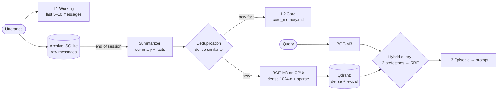

# RAG and memory: hybrid search, source citations, deduplication

> Two working retrievers with different jobs and one designed one. Long-term memory for a voice
> assistant on a hybrid index (dense + sparse, RRF), document search with a mandatory link to the
> source, and a method for sizing the index for production.

**Projects:** [Zapoy](zapoy.md) · [AIkimat](aikimat.md) · [smeta-ai-kz](smeta-ai-kz.md) (planned)
**Stack:** BGE-M3 · Qdrant (hybrid query, RRF) · SQLite · FastAPI · LangGraph · `typing.Protocol`

---

## Zapoy: three-level memory on a hybrid index

| Level | What | Where | When it goes into the prompt |
|---|---|---|---|
| L1 Working | last 5–10 messages | process memory | always, after the static part |
| L2 Core | facts about the owner | `core_memory.md` | always, in full |
| L3 Episodic | session summaries and explicit facts | Qdrant | top-N by hybrid search |
| Archive | raw messages | SQLite | never directly |

**Why hybrid.** Dense search loses names, numbers and rare terms — exactly what you look for when
asking "what did I say about X". Sparse loses paraphrase. BGE-M3 produces both representations in a
single forward pass, so the hybrid costs one extra prefetch inside Qdrant.

**Why RRF rather than a weighted sum.** Reciprocal Rank Fusion works on ranks: no need to normalize
incomparable scales or tune weights that are easy to get wrong.

**A threshold only on the dense branch.** Without it RRF returns the five nearest points even for a
query unrelated to anything in memory, and every prompt drags along five irrelevant "memories". The
sparse branch deliberately has no such threshold: its scores are unbounded sums of term weights, so a
fixed cutoff would be meaningless there.

**Semantic deduplication of facts.** A hash catches only byte-identical repeats, while in practice
the summarizer rephrases an already known fact. Core Memory goes into every prompt, so each duplicate
is a permanent tax on the context. Before a new fact is stored it is compared against the index, and
only dense is used here: paraphrase is exactly what we are looking for, while the lexical half would
score the two wordings as different.

**Budget.** The retriever fits into 200 ms per stage. HTTP clients for Qdrant and the embedding
service live at module level: a new client per call cost milliseconds of connection setup. BGE-M3
runs on the CPU in a separate container with no GPU access, so video memory stays with the LLM.

**Evaluation.** 57 cases for memory search and 54 for facts in my own eval engine
([MLOps case study](ml-lifecycle.md)).

## AIkimat: document search with a mandatory source

- Word-based chunking: 500 words with an overlap of 50. Guarded against `overlap >= chunk_size`.
- `retrieve(query, top_k, metadata_filter)` on top of a `VectorStore` behind `typing.Protocol`: the
  store and the embeddings can be swapped without touching the logic.
- Every answer cites its source (`format_citation`). In a government office an answer without a
  reference to a document is useless.
- Honestly, as in the project's own documentation: embeddings are currently lexical, based on
  trigram hashes, and search is linear in memory. The first version hashed the whole string, and
  `top_k` returned every document in a row — unnoticeable while the corpus was small. Switching to
  trigrams was a separate fix. The path to production is a real multilingual model (multilingual-e5 /
  bge-m3 class) and pgvector or Qdrant.
- Index sizing for production: 10,000 documents ≈ 30,000 chunks ≈ 120 MB of vectors (1024-d, fp32)
  plus an HNSW index 1.5–3 times larger. The conclusion: storage for the index is cheap compared to
  GPUs.

## smeta-ai-kz: RAG over building codes — planned

RAG over the SNiP RK corpus on Qdrant is designed but not implemented: the `rag/` folder currently
holds only a description. In the current MVP reconciliation against standards is deterministic, via
an SQLite rate database and fuzzy matching.
