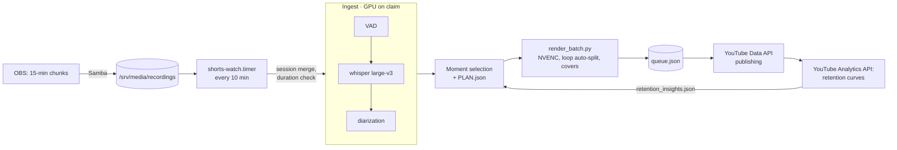

# Shorts-Maker — a stream-clipping pipeline with an analytics feedback loop

> A personal production pipeline for a YouTube channel: OBS stream recordings → transcription and
> diarization on the GPU server → moment selection → vertical clip rendering → a publishing queue via
> the YouTube API. Retention data from the YouTube Analytics API changes the cutting parameters for
> the next batches.

**Role:** author and operator of the pipeline · **Status:** in production, hundreds of clips published
**Stack:** Python · faster-whisper large-v3 (float16) · pyannote 4 · Silero VAD · ffmpeg / h264_nvenc · YouTube Data & Analytics API · Docker · systemd timers · Samba
**Numbers:** 440+ commits · 1,260+ tests · transcription with diarization at ≈14× real time
**Code:** private

---

## How it works

- The heavy stages (whisper, diarization, rendering) run on the server in their own Docker image.
  This pipeline shares hardware with the paid service, not code. It takes a card through the claim
  protocol ([server case study](gpu-server.md)).
- Rendering goes through a single entry point, `render_batch.py`. The low-level `render.py` has about
  60 flags, and missing any of them silently switches a feature off. One clip went to the channel
  that way without profanity beeps and without the name banner. Since then assembling a render by
  hand is forbidden.
- Render features: word-level subtitles, profanity bleeping (audio + asterisks in subs), a name
  banner, social capsules, an outro card, a cold-open teaser, seamless loops, covers.

## Feedback loop: data changes the config

The `retention` script pulls retention curves for every clip and writes aggregates to a contract
file that is read at the next selection.

| Clip length | Retention |
|---|---|
| under 20 s | 64 % |
| 20–25 s | 54 % |
| 25–30 s | 51 % |
| 30–35 s | 50 % |
| 35+ s | 44 % |

- Finding: the step is at **20 seconds**, not at 25 as the first sample suggested. The first version
  of the finding was spoiled by fresh videos that had not collected views yet. Since then aggregates
  are computed only over "mature" videos.
- Action: `max_seconds` 35 → 26. The main lever, though, is the lower length bound (`min_seconds`),
  not the upper one. In the first review 14 of 17 videos were longer than they should have been; the
  next batch landed within range.
- Optimization: the analytics query window is bounded by each video's publish date. The run went
  from 2 hours to 1 min 42 s.
- Still open: a vocabulary of moment tags (149 of 165 tags occur only once — a fixed vocabulary is
  needed) and a natural experiment on five clips longer than 26 s.

## Incidents

| What happened | Cause | Fix |
|---|---|---|
| whisper hung for 10 hours | HuggingFace checked the model version over the network with no timeout | `HF_HUB_OFFLINE=1`, weights on a volume |
| 400 GB of merges for 60 GB of recordings | The watcher re-merged a session on every pass | `prune.py` freed 288 GB; archiving originals with a size and duration check: volume 70 % → 15 % |
| Publishing "succeeded" (exit code 0) but nothing was uploaded | The clips were on the server while the script looked for them on a local disk | Result checked via `queue.json` (`status`/`video_id`), not via the exit code |
| `ytAgeRestricted` because of a single phrase | YouTube content filter | `profanity.py --risk-rules`: rules by phrase, not by word root (the Russian for "crew member" contains a slang root but is normal speech) |
| The runner killed its own `trap` / `pkill -f` cut its own SSH session | `exec` in the wrapper; a pattern that was too broad | Runner rewritten, exact PIDs |
| Diarization found 10 voices for 4 people in a voice chat | Compressed Discord audio | Diarization is an optional signal, not the truth |
| Two copies of the pipeline instructions drifted apart for 3 weeks | Copying instead of linking | A junction to a single source |

## Sibling: longcut-maker

The same approach for long horizontal 16:9 videos: `review` / `highlights` / `full-recap` presets,
background music matched to the mood of each moment (ambient / energetic / tense / funny), YouTube
metadata generation. 25 commits, 160+ tests.
