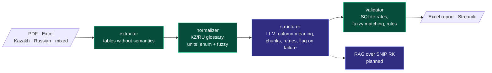

# smeta-ai-kz — AI review of construction estimates where the model isn't trusted with numbers

> An MVP for a Kazakhstan developer as part of an accelerator's scouting programme (BI Group + MOST BI):
> intake of PDF/Excel estimates in Kazakh and Russian → line-item extraction → reconciliation against
> a database of standard rates → an Excel report and a Streamlit interface. RAG over SNiP RK
> (Kazakhstan building codes) is designed and is the next stage.

**Role:** solo, from spec to demo · **Timeline:** MVP in 10 days, development afterwards
**Stack:** Python · Claude API · pdfplumber/openpyxl · rapidfuzz · SQLite · Streamlit · pytest
**Numbers:** 30 commits · 66 tests
**Code:** private (real client documents never enter the repository)

---

## The key decision: the line between the model and the code

A mistake in an estimate figure costs money, and a language model is unpredictable. So the model gets
only semantics: understanding what a line item is and what the table columns mean. Arithmetic, units
of measurement and reconciliation against the rate database are deterministic code that can be
tested.

Purple marks the LLM steps, green marks the deterministic ones. The dashed line is the RAG over building codes on Qdrant — designed but not implemented yet.

## Details

- **Units of measurement** — a fixed enum plus fuzzy matching with a threshold of 85. At a lower
  threshold "m³" starts matching "m²". Anything that does not match is passed through as is, with a
  flag, rather than guessed.
- **Table structuring** — in chunks, with retries. A chunk that cannot be recognized is flagged, not
  silently dropped. After an external review, every chunk receives a description of the original
  table's columns: without it the model confused "quantity" and "price" in table continuations.
- **Validator** — an SQLite database of standard rates, fuzzy matching of line items, cross-check
  rules. Written by the agent swarm [swarm-orchestrator](swarm-orchestrator.md) in an isolated
  worktree and accepted after review.
- **Environment pitfalls:** Cyrillic in the path breaks pytest's `tmp_path` (solved with
  `--basetemp`); reportlab cannot write Cyrillic in test PDFs without registering a TTF font.

## Honest limitations

This is a competition demo, not production. RAG over SNiP RK is not implemented yet: the current version checks only against the rate database. The rate database in tests is synthetic; the real
document corpus never enters git. The outcome of the accelerator is not covered in this case study.
