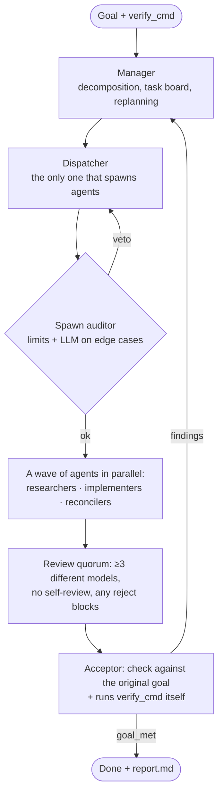

# swarm-orchestrator — an LLM agent swarm that doesn't take agents at their word

> An autonomous orchestrator of several models (Claude, GPT, Nemotron) over an HTTP gateway: it
> breaks a goal into tasks, hands them to agents in parallel, runs every artifact through a review
> quorum of different models, and accepts the work only after running a real verification command on
> the machine.

**Role:** author · **Status:** used on real tasks in my other projects
**Stack:** Python · concurrent.futures · JSON agent contract · pytest (142 tests, 83 % coverage)
**Code:** public — [zhoratolk/swarm-orchestrator](https://github.com/zhoratolk/swarm-orchestrator)

---

## Why

Subagents inside a single assistant are expensive and see the world through one model's eyes. Here
the swarm is an ordinary Python process. It calls the gateway in parallel itself, spreads roles
across different model families, and does not accept a result on the agent's self-report.

## Roles and loop

## Engineering decisions

- **Acceptance by fact.** The acceptor checks the result against the original goal, not against the
  task list, and runs `verify_cmd` itself — a real shell command: tests, a file check, an HTTP
  request.
- **Command-injection guard.** If an LLM decomposed the goal, then `verify_cmd` was written by a model
  behind an external gateway and nobody read its answer. Such commands are tagged
  `verify_cmd_source: llm` and are not executed without an explicit `allow_llm_verify_cmd: true`.
- **Stop conditions:** success; impossibility confirmed by two other models; a stall (3 iterations
  without fewer blockers); the budget ceiling or a persistent 429. The run is saved in `board.json`
  and can be continued with `--resume`.
- **Secret and personal-data scrubber** (`scrub.py`) before every external call: keys, passwords,
  connection strings, full names, phone numbers, IIN/BIN-like numbers are replaced with
  `<SECRET:type>`. Other people's data goes only to models with a `no_training` policy.
- **Cost accounting:** actual cost from `usage.cost` in every response plus a "shadow" cost from a
  pinned price table. It turned out that one "free" model actually charges money. The `free` flag
  does not guarantee $0, so `usage.by_model` in the report is checked.
- **Resilience:** exponential retry on 429/5xx; a dead model (403 geoblock, 429
  `model_requires_purchase`) is removed from the pool for the run with a fallback; when an answer is
  cut off at `max_tokens` the budget is doubled and the request repeated; answers are normalized when
  a model breaks the JSON schema.

## Where it was used

The swarm always works in an isolated git worktree, on a separate branch. A human reads its diff
before merging.

- **smeta-ai-kz** — the `validator/` package: an SQLite database of standard rates, fuzzy matching of
  line items, cross-check rules.
- **AIkimat** — `/audit` pagination with backward compatibility and a configurable `topK` in `/chat`.
- **Itself** — a self-improvement run on a copy of its own code.

## A limitation I live with

The free gateway depends on the network it is called from. From some networks Anthropic and OpenAI
models return 403 (upstream geoblock), and the fallback model runs into 429. The swarm then stops
honestly on a stall instead of passing off a half-empty result as finished — that is what happened
when I tried to translate this very portfolio with it.
