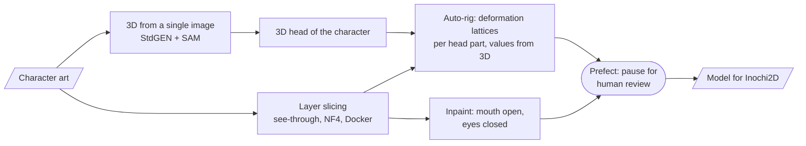

# Vtube ACMT — generative models for VTuber auto-rigging: research with measurements

> A contributor to someone else's repository, working only through pull requests. The project's goal
> is to go from a prompt to a finished VTuber model, ideally a phone app with rendering and face
> tracking. My part is applied ML research: running generative models on my own GPU server,
> measuring time and memory, 3D reconstruction of a character from a single image, an auto-rig
> driven by 3D, inpainting, a pipeline with human review, and licensing research. Negative results
> are recorded alongside the positive ones.

**Role:** contributor (58 commits, pull requests structured as "what → why → options → how it was checked → risks") · **Status:** research
**Stack:** Python · PyTorch · Docker · CUDA extensions (nvdiffrast, pytorch3d) · StdGEN · SAM · see-through · inpainting models · Prefect · Inochi2D
**Code:** the project owner's private repository

---

## What was done

## Generative models on my own hardware: measurements

Every run used the guest RTX 3060 12 GB of the home server. The card was taken through the claim
protocol, so the paid queue on the neighbouring card routed around it
([server case study](gpu-server.md)). Weights and outputs stay on the server; the repository holds
only code, the Dockerfile and reports.

**Slicing art into layers (see-through)** — compared with the author's reference run on an RTX 3050:

| Run | Mode | Time | PyTorch peak | Outcome |
|---|---|---|---|---|
| author, RTX 3050 | NF4, all on the card | 30 min | 6.7 GB | works |
| RTX 3060 | NF4, seed 42 | 12.6 min | 6.7 GB | works |
| RTX 3060 | the same run again | 12.6 min | 6.7 GB | output identical byte for byte |
| RTX 3060 | full bf16 weights, offload to RAM | 13.6 min | 9.6 GB | works |
| RTX 3060 | full bf16 weights, all on the card | — | — | did not fit into 12 GB |

The takeaway: on a 3060 slicing runs 2.4 times faster than the reference, NF4 keeps the PyTorch
memory peak at 6.7 GB, and the run is deterministic by seed — a repeat matches byte for byte.

**3D reconstruction from a single image (StdGEN, CVPR 2025)** — about 11 minutes per character:
7.5 minutes to generate 6 views × 3 semantic levels, ~2 minutes of refinement. Weights are 48 files,
19 GB, plus SAM ViT-H. In its original configuration stage 3 does not fit into 12 GB:
`torch.index_select` asks for 10.73 GiB in a single tensor with 8.3 GiB free. Upstream does not build
on fresh dependencies — I worked out three places and captured them in the Dockerfile (for example,
`nvdiffrast` and `pytorch3d` build only with `--no-build-isolation` against the installed torch).

**Preview rendering on the server's CPU** in a container on 36 threads: 240 frames in 1.5–2.5
minutes instead of 9 — no GPU needed.

## What 3D gives the rig — in numbers

- **How much "new" appears on a turn.** When the head turns by ±30°, 13–14 % of the silhouette is
  area that does not exist on the flat picture at all, and 22–24 % for hair. With a turn plus an
  upward tilt it reaches 33–34 %. This estimates how much a flat rig has to "make up".
- **An auto-rig driven by a 3D head.** A deformation lattice per head part (face, nose, eyes, fringe,
  strands, ears). The lattice values are a projection of the same character's 3D head at ±30° fitted
  by least squares. The results were distilled into portable rules: "measure on the model, not on
  the picture", "the unit of measurement is the distance between the eyes, not pixels".
- **Checked against a rigger's hand-made rig.** A script extracts from our key poses the same values
  that were measured on the reference model. Silhouette IoU with 3D at ±20° is 0.80–0.84 versus 0.864
  at rest.
- **A merged fringe versus strands.** A single piece reproduces 85 % of the displacements: the spread
  between strands is 0.216 of the eye distance, while the merge error is 0.031 on average.

## Negative results are results too

- **Splitting a merged fringe back into strands did not work.** The goal — 4 of 5 strands with
  IoU ≥ 0.7 — was not reached. Adding depth predicted by a model made it worse: mean IoU fell from
  0.57 to 0.515.
- **"Hair volume" layers** raised silhouette IoU from 0.81 to 0.84, but the result was rejected on
  looks. This path is closed and should not be repeated.

## Pipeline and licences

- **A Prefect pipeline:** stages on top of the demo scripts, pauses for human review, a review page.
- **Inpainting** of "mouth open" / "eyes closed" variants by mask, mouth animation, a blink check and
  a comparison with the author's rig.
- **Licensing research:** psd2live (GPL-3, a grey zone under the Live2D EULA), Illustrious/NoobAI
  models (the FAIPL licence forbids a paid service), disputed training data behind see-through. The
  decision: our own format compatible with Inochi2D, and a swappable rig backend chosen by testing.
