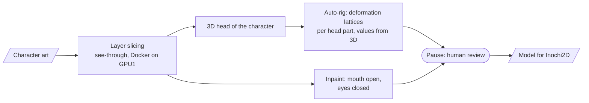

# Vtube ACMT — researching an auto-pipeline from "art" to a rigged VTuber model

> A contributor to someone else's repository, working only through pull requests. The goal: from a
> prompt to a finished VTuber model, ideally a phone app with rendering and face tracking. My part —
> technology and licensing research, GPU benchmarks on the server, a pipeline with human review, and
> an auto-rig driven by a 3D head of the character.

**Role:** contributor (58 commits, pull requests structured as "what → why → options → how it was checked → risks") · **Status:** research
**Stack:** Python · PyTorch · Docker · Prefect · inpainting models · 3D head reconstruction · Inochi2D
**Code:** the project owner's private repository

---

## What was done

- **GPU benchmarks on the server.** `see-through` slicing in a Docker image on the guest RTX 3060:
  time and peak memory compared with the author's reference run on an RTX 3050. The card is taken
  through the standard claim protocol, so the paid queue on the neighbouring card routes around it
  ([server case study](gpu-server.md)). All weights and runs stay on the server; the repository holds
  only code and the report.
- **A Prefect pipeline:** stages on top of the demo scripts, pauses for human review, a review page.
- **Head auto-rig:** a lattice for every head part (face, nose, eyes, fringe, strands, ears); the
  lattice values are a projection of the same character's 3D head rotated by ±30°, fitted by least
  squares. The results were distilled into portable rules. The main ones: "measure on the model, not
  on the picture" and "the unit of measurement is the distance between the eyes, not pixels".
- **Licensing research:** psd2live (GPL-3, a grey zone under the Live2D EULA), Illustrious/NoobAI
  models (the FAIPL licence forbids a paid service), disputed training data behind see-through. The
  decision: our own format compatible with Inochi2D, and a swappable rig backend chosen by testing.
- **Negative results are recorded too:** "hair volume" layers raised silhouette IoU only from 0.81
  to 0.84 and were rejected. Don't repeat that approach.
