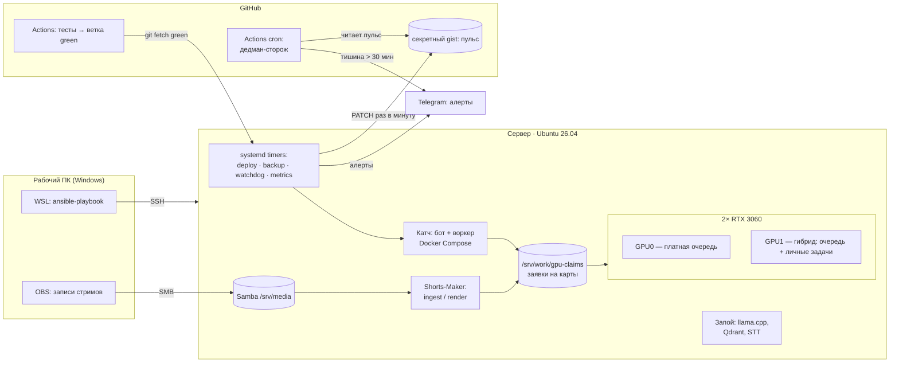

# Домашний GPU-сервер: от закупки железа до инфраструктуры как кода

> Сервер на двух RTX 3060, на котором в продакшене работают три сервиса. Описан Ansible-плейбуком,
> деплоится сам, сообщает о своей смерти через внешний сторож на GitHub Actions.

**Роль:** проектирование, закупка, сборка, эксплуатация · **Статус:** работает с 25.08.2026
**Стек:** Ubuntu Server 26.04 · NVIDIA driver 595 · Docker 29 · NVIDIA Container Toolkit (CDI) · Ansible · ufw · systemd · Samba · Tailscale · GitHub Actions
**Код:** приватный; фрагменты — [`snippets/ansible_site.yml`](../snippets/ansible_site.yml), [`snippets/ansible_firewall.yml`](../snippets/ansible_firewall.yml), [`snippets/gpu_pool.py`](../snippets/gpu_pool.py); сторож — публичный [zhoratolk/shortmaker-deadman](https://github.com/zhoratolk/shortmaker-deadman)

---

## Задача

Нужна была машина под GPU-нагрузку: транскрипция (faster-whisper large-v3), диаризация (pyannote) и
рендер видео на NVENC для платного сервиса и личного пайплайна. Облачные GPU для этой нагрузки
дороже за месяц, чем сам сервер. Ограничения: бюджет домашнего сервера, квартира без ИБП, медленный
и нестабильный канал.

## Железо — посчитано до покупки

| Компонент | Выбор | Почему |
|---|---|---|
| Плата | Huananzhi X99-F8 | 2× PCIe x16 под две карты; второй M.2 — PCIe 2.0, учтено до покупки |
| CPU | Xeon E5-2697 v4, 18C/36T | потоки под параллельный ffmpeg и CPU-фильтры, 145 Вт |
| RAM | 32 ГБ DDR4 ECC Reg, 4×8 | все четыре канала заняты |
| GPU | 2× RTX 3060 12 ГБ | 12 ГБ VRAM на карту — large-v3 в float16 (~5 ГБ) + рендер с запасом |
| Диски | NVMe 512 ГБ (система, LVM) + NVMe 1 ТБ (`/srv/work`) | ОС отдельно от рабочих данных |
| БП | 750 Вт | ~545 Вт под нагрузкой с двумя картами, ~100 Вт в простое |

Рассматривалась RTX 4060 Ti 16 ГБ — отклонена: за ту же цену две 3060 дают два NVENC-чипа и вдвое
больше SM, а задача параллелится по картам без NVLink.

## Архитектура

## Инженерные решения

**Сервер как код.** Три недели сервер жил как набор команд в истории чата. Потом он был описан
Ansible-плейбуком из восьми ролей (`base`, `network`, `storage`, `docker`, `gpu`, `samba`, `ops`,
`firewall`). Критерий правды: `ansible-playbook site.yml --check --diff` против живого сервера
показывает `changed=0`. Роли покрыты тестами по разобранному YAML. Плейбук не пишет секреты
(env-файлы создаются пустыми и заполняются интерактивно), не форматирует диски (только монтирует) и
не рестартит приложение — это работа деплой-агента.

**Файрвол, который не отрезает сам себя.** Правила идут первыми, политика `deny` — последней задачей
и только под флагом `firewall_enabled`. Иначе прогон по SSH закрывает сам себя на середине. Отдельно
разобран Tailscale: без правила на `41641/udp` он молча уходит в DERP-реле, без ошибок в логах.
Шум IGMP-запросов роутера (≈4000 строк в сутки в журнале ядра) отбрасывается до цепочки логирования.

**Две карты на два проекта без общего планировщика.** Платная очередь и личный пайплайн — разные
репозитории без общего кода. Протокол заявок: файл `/srv/work/gpu-claims/gpu<N>`, свежесть по `mtime`
(touch раз в 30 с, протухание через 120 с). Держатель, упавший на середине, не оставляет вечную
блокировку. Если заняты все карты — заявки игнорируются: заявка это просьба, а не лок, и платная
работа не должна вставать. Худший случай — замедление, а не простой.

**Сетевые правки по SSH — только с таймером отката.** `systemd-run --on-active=300` восстанавливает
бэкап netplan, если не отменить его вручную после проверки.

## Мониторинг и выживаемость

- **Сторож на сервере** (`watchdog.py`, systemd): сервис, точки монтирования, GPU, алерты в
  отдельный send-only Telegram-бот. Токен лежит только в root-only env-файле (`600`).
- **Дедман-свич снаружи.** Мёртвый сервер ничего не отправит, а тишина неотличима от здоровья.
  Поэтому сервер раз в минуту пишет `<epoch> ok|fail` в секретный gist, а публичный репозиторий
  раз в 15 минут проверяет, насколько запись устарела. Замер показал, что cron в GitHub Actions
  опаздывает: медиана 163 мин, максимум 342 мин. Поэтому добавлен второй, быстрый сторож на ноутбуке
  (задача планировщика раз в 5 минут). Внешние сервисы (healthchecks.io, Better Stack) не подошли:
  регистрация не проходила.
- **Бэкапы 3-2-1** с шифрованием; пароль хранится только вне машины; восстановление проверяется
  распаковкой, а не кодом возврата.
- Сообщение после загрузки, еженедельный дайджест метрик, Wake-on-LAN.

## Инциденты — постмортемы

| Симптом | Причина | Фикс |
|---|---|---|
| Три «тихие» смерти за неделю: журнал обрывается на полуслове, нет ни паники, ни MCE, ни OOM | Просадки электричества в квартире. Нашлось по журналу питания **ноутбука**: 92 переключения на батарею за двое суток, два совпали с гибелью сервера до секунды | Правило: необъяснимое падение — сначала журнал питания; ИБП в плане |
| После сбоя питания сервер не поднимается сам | `Restore AC Power Loss = Power Off` с момента сборки | `Last State` в BIOS |
| Сборка образа не укладывается в час → бесконечный цикл «убить по таймауту → откатиться → собрать заново» | После `docker builder prune -a` слой torch+CUDA (~4 ГБ) качался заново на медленном канале | pip cache mount в Dockerfile, `BUILD_TIMEOUT` 4 ч = худший наблюдённый холодный билд, а не круглое число |
| `NVIDIA_DRIVER_CAPABILITIES` ни на что не влияет | Toolkit 1.20 + Docker 29 работают через CDI, а CDI эту переменную не читает | Переменная оставлена страховкой для legacy-рантайма, тест держит Dockerfile и compose в согласии |
| Порты контейнеров доступны мимо ufw | Цепочка `DOCKER` стоит раньше `INPUT` | Публиковать порты на конкретный адрес / `DOCKER-USER` |
| Сеть «то есть, то нет» после обрыва | Кабель: `Lost carrier / Gained carrier` каждые несколько секунд | Статический адрес через роль `network`, диагностика `journalctl -u systemd-networkd` |

## Что дальше

ИБП с NUT по USB; резервация адреса по MAC на роутере; дашборд Prometheus/Grafana поверх
существующего textfile-экспорта метрик.
