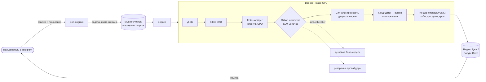
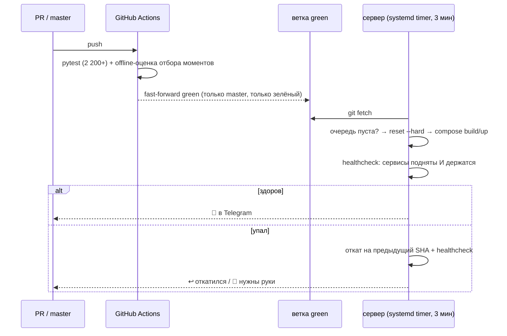

# Катч — SaaS для нарезки стримов на GPU-сервере

> Telegram-сервис для русскоязычных стримеров: присылаешь ссылку на запись стрима, получаешь
> вертикальные шортсы 9:16 с субтитрами, хуками и метаданными. Полный цикл от ссылки до готового
> клипа, CI/CD с автоматическим откатом, оценка качества LLM-отбора, учёт стоимости каждой задачи.

**Роль:** владелец продукта и инфраструктуры: архитектура, эксплуатация, продуктовые решения · **Статус:** закрытая бета
**Стек:** Python 3.12 · aiogram · SQLite · Docker Compose · faster-whisper large-v3 · Silero VAD · pyannote 3.1 · ffmpeg/NVENC · несколько LLM-провайдеров с фолбэком · GitHub Actions · systemd
**Цифры:** 290+ коммитов · 2 200+ тестов · ~11 ₽ себестоимость обработки трёхчасовой записи
**Код:** приватный; фрагменты — [`snippets/deploy_agent.py`](../snippets/deploy_agent.py), [`snippets/ci_green_branch.yml`](../snippets/ci_green_branch.yml), [`snippets/gpu_pool.py`](../snippets/gpu_pool.py)

---

## Пайплайн

Статус-машина задачи: скачиваю → транскрибирую → ищу моменты → жду выбора → рендерю → доставлено →
очищено. Исходник (4–8 ГБ) удаляется после обработки. Готовые клипы живут 48 часов, и локальный
файл удаляется **только после подтверждённой загрузки в облако**. Если загрузка не прошла после
ретраев, клип уходит в карантин на отдельный том, а не пропадает.

## CI/CD: «протестировано» — это git-ref, а не слова в коммите

- Сервер тянет изменения сам (pull-модель): ни токена, ни вебхука, ни открытого порта. Ему достаточно
  уметь `git fetch`.
- Деплой не начинается, пока в очереди есть рендер. Если очередь не читается, деплой тоже не
  начинается: опоздать с деплоем лучше, чем убить чужой рендер.
- Healthcheck опрашивает сервисы дважды с паузой. Контейнер в crash-loop проходит `up -d` успешно и
  падает через секунду, поэтому одной проверки мало.
- Откат нужен, чтобы деплой мог работать без присмотра. Деплой без отката превращается в плановый
  простой.
- `BUILD_TIMEOUT` = 4 ч выбран по худшему наблюдённому холодному билду. С таймаутом в час билд на
  медленном канале убивался, откатывался и начинался заново каждые 60 минут.

## GPU: явное распределение, а не «само как-нибудь»

`worker/gpu_pool.py`: `lease()` выдаёт индекс наименее загруженной карты. Через `ContextVar` он доходит
до ffmpeg (`-hwaccel_device`, `-gpu`), faster-whisper (`device_index`) и pyannote (`cuda:N`). Без этого
все четыре библиотеки молча берут карту 0, и вторая карта простаивает. Из расчётов:

- **Потолок параллелизма — сессии NVENC, а не память.** Лимит драйвера — 8 сессий на систему, не на
  карту. Бюджет в коде — 6, с запасом. При превышении рендер тихо откатывается на libx264, поэтому
  проверять приходится фактом, а не по симптомам.
- Две транскрипции на одной карте почти не ускоряют работу: они делят одни SM. Транскрипция одной
  задачи и рендер другой накладываются почти бесплатно, потому что рендер занимает NVDEC/NVENC и CPU.
- Модели закреплены по хэшу ревизии (whisper large-v3, pyannote 3.1), веса лежат на именованном томе,
  чтобы не скачиваться на каждом деплое.

## LLM: экономика и надёжность

- **Цепочка провайдеров с circuit breaker'ом на каждого.** Сначала дешёвые flash-модели, дорогая
  подключается там, где без неё падает качество. Пустой ответ модели считается отказом так же, как
  мёртвый эндпоинт.
- **Бейк-офф локальной LLM против облачной.** `qwen3-32b` на этих картах обрезал момент до
  панчлайна, а облачная flash-lite стоит ~$0.06 за запись. Самохостинг не окупается, решение
  зафиксировано вместе с цифрами.
- **Cost guard:** стоимость считается по каждой стадии и по фактической модели, а не по одной цене
  на всё.
- **Себестоимость (замерено):** ~11 ₽ за трёхчасовую запись, из них LLM ≈ $0.03 в час, остальное —
  электричество.

## Оценка качества LLM-отбора (eval harness)

Когда меняешь промпт, непонятно, стало лучше или хуже. Юнит-тесты проверяют, что функция вернула
список, но не то, что моменты в нём хорошие. Разметки нет: 248 доставленных клипов, ни одного
отклонённого кандидата. Поэтому оценка разбита на три слоя, и названия слоёв не дают выдать один
за другой:

1. **Инварианты** (в CI на каждый пуш, без API, ~1 с): окно внутри записи, длительность в границах,
   хук-цитата реально звучит в этом окне, нет дублей, ранжирование упорядочено, «починка»
   идемпотентна, результат не зависит от порядка ответа модели.
2. **Baseline:** тот же корпус через тот же код, сравнение с замороженным результатом. Дрейф —
   ошибка сборки. Принять новый результат можно только отдельным флагом.
3. **Качество** (recall@k, IoU границ): заблокировано до появления разметки. Сырые ответы модели
   уже пишутся в отдельную колонку, чтобы разметку было на чём считать.

Урок с первого прогона: харнесс нашёл «баг», которого не было. Он пропускал шаг `drop_overlapping`,
который есть в проде. Правило с тех пор: **харнесс повторяет прод шаг в шаг** и импортирует функции
из пайплайна, а не копирует их.

## Метрики

Шесть чисел вместо дашборда: время до списка моментов на час записи, доля ожидания в очереди,
на какой стадии задачи останавливаются, доля фолбэков по провайдерам, стоимость задачи (медиана и
p90), сколько пользователей не вернулись выбрать моменты. Считаются медианы, а не средние.
Источник — `job_events` в SQLite. Выгрузка в формате textfile-коллектора node_exporter уже есть,
Grafana отложена сознательно: при десятке задач в день два лишних контейнера ради тех же шести
чисел — это церемония.

## Инциденты

- **Облачная чистка удаляла файлы, но не строки в базе.** Парсер ждал `<id>.mp4`, а реальные имена —
  `"<заголовок> (<id>).mp4"`. Тестовая фикстура ошибалась так же, как код, поэтому тест был зелёным.
  126 строк ссылались на удалённые файлы → после фикса 65, ровно по числу живых.
- **Панч-зум обрезал пятую часть клипа:** `zoompan d=1` с `fps=60` на 30-кадровом источнике делал
  видео короче звука.
- **Аудит бизнес-логики нашёл шесть дыр:** не сбрасывалась месячная квота; cost guard не считал
  дорогую стадию; квота не возвращалась при падении задачи; брошенные задачи держали 4–8 ГБ на
  диске бессрочно. Теперь срок зависит от тарифа, а напоминания приходят раз в 3 часа, не больше
  четырёх.
- **SQLite `CURRENT_TIMESTAMP` хранит время с точностью до секунды.** Задача, созданная в ту же
  секунду, не считается «старше, чем сейчас».

## Честные ограничения

Платежи не подключены, платящих пользователей пока нет, бета идёт на знакомых. Очередь — SQLite:
на текущей нагрузке этого хватает, при росте план — Redis/RabbitMQ. Метрики качества отбора ждут
разметки.
