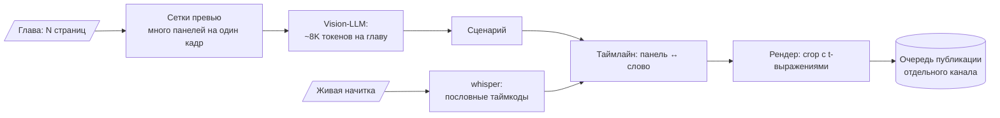

# manga-shorts — видеообзоры с vision-моделью на бюджете токенов

> Пайплайн видеообзоров вебтуна для второго канала: главы и живая начитка автора → разбор панелей →
> сценарий → таймлайн по пословным таймкодам → рендер с плавным движением камеры по панели →
> метаданные → очередь публикации.

**Роль:** автор · **Статус:** все 5 фаз построены, ждёт сквозного прогона на реальном выпуске
**Стек:** Python · vision-LLM · faster-whisper (word timestamps) · ffmpeg · YouTube Data API
**Цифры:** 37 тестов
**Код:** приватный

---

## Главное решение: vision-модель смотрит на сетку превью, а не на каждую страницу

- **Бюджет токенов — жёсткий контракт:** ~8K токенов на главу за счёт сеток превью. Постраничный
  разбор стоил бы в разы больше.
- **Движение камеры** — `crop` с выражениями от времени, а не `zoompan`: у `zoompan` дрожит
  субпиксельное позиционирование.
- **TTS отвергнут** — начитка живая, голос автора и есть продукт.
- **Изоляция:** собственный пакет `mshorts/` (имя `scripts/` затенило бы соседний установленный
  пайплайн) и отдельные очереди публикации второго канала.
- Правила гигиены: страницы манги никогда не коммитятся, тайтл в истории не называется.
