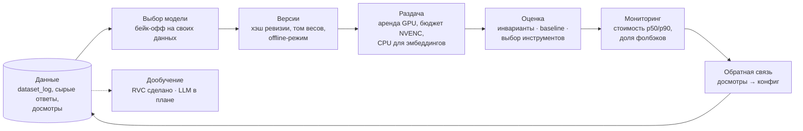

# MLOps: полный жизненный цикл модели в моих проектах

> Сводный кейс: как модели проходят путь от данных до продакшена и обратно. Выбор модели на своих
> данных, закрепление версий, раздача на GPU, оценка качества, мониторинг стоимости, петли обратной
> связи и дообучение. Каждый пункт взят из работающего проекта, а не из учебника.

**Проекты:** [Катч](katch.md) · [Shorts-Maker](shorts-maker.md) · [Запой](zapoy.md) · [manga-shorts](manga-shorts.md) · [домашний GPU-сервер](gpu-server.md)
**Стек:** faster-whisper · pyannote · llama.cpp (GGUF, GBNF) · BGE-M3 · Qdrant · RVC (HiFi-GAN) · OpenRouter · GitHub Actions · SQLite · YouTube Analytics API

---

## Цикл целиком

## 1. Данные собираются с первого дня

- **`dataset_log` в Катче** — отдельная append-only таблица, не смешанная с очередью. На каждый
  отрендеренный клип пишутся фрагмент транскрипта, таймкоды выбранного момента, обоснование LLM,
  финальный хук и тег источника (`friends_beta` / `public_free` / `premium_analytics`). Поле
  эффективности по умолчанию `NULL` и заполняется позже, из аналитики или от пользователя. Цель —
  датасет для будущего дообучения локальной модели, который копится сам, без отдельного проекта.
- **Сырые ответы модели до «починки»** лежат в отдельной колонке. Без них разметку не на чем
  считать: в базе остаётся только результат после исправлений, и не видно, что именно модель
  ошиблась. Стоит ~100 КБ на четырёхчасовую запись, поэтому запись выключается флагом.
- **Метрики досмотров** из YouTube Analytics API по каждому клипу складываются в контрактный файл,
  который читает отбор моментов ([Shorts-Maker](shorts-maker.md)).

## 2. Модель выбирается на своих данных, а не по репутации

`tools/model_bakeoff.py` прогоняет несколько моделей параллельно на одних и тех же кусках реальной
записи и тем же кодом, что в проде: тот же чанкинг, та же «починка», тот же фильтр. Фолбэк
провайдера в бейк-оффе принудительно выключен, иначе ответ одной модели мог бы молча записаться на
счёт другой. Результат на записи длиной 4,6 часа:

| Модель | Моментов после фильтра | Время, с | $ за запись |
|---|---|---|---|
| claude-sonnet-5 | 9 | 226 | 0.454 |
| gemini-3.7-flash | 8 | 28 | 0.085 |
| glm-5.3-flash | 8 | 416 | 0.015 |
| qwen3.7-flash | 7 | 90 | 0.007 |
| minimax-m3 | 6 | 259 | 0.064 |
| deepseek-v4-flash | 6 | 1132 | 0.011 |
| qwen3.8-flash | 4 | 205 | 0.031 |

Число моментов — не метрика качества, поэтому в файл результата пишется каждый найденный момент
вместе с транскриптом под ним. Решающим было чтение этих моментов человеком. В прод пошли дешёвые
flash-модели цепочкой с фолбэком, дорогая модель осталась резервом. Отдельный бейк-офф локальной
`qwen3-32b` на своих картах показал, что она обрезает момент до панчлайна, и самохостинг LLM был
отклонён с цифрами на руках.

## 3. Версии моделей закреплены

- whisper large-v3 и pyannote diarization-3.1 закреплены по хэшу ревизии, а не по имени: обновление
  модели на хабе не меняет прод молча.
- Веса лежат на именованном Docker-томе (`HF_HOME`), а не в слое образа: деплой их не скачивает
  заново.
- `HF_HUB_OFFLINE=1` в проде. Без него whisper однажды завис на 10 часов на сверке версии по сети
  без таймаута.
- Эталон оценки тоже версионирован: baseline в репозитории, принять новый можно только отдельным
  флагом.

## 4. Раздача: железо считается, а не угадывается

- **Аренда GPU** через `lease()` с `ContextVar`: индекс карты доходит до ffmpeg, whisper и pyannote.
  Две транскрипции на одной карте почти не ускоряют работу, а транскрипция плюс рендер
  накладываются почти бесплатно — разный кремний.
- **Потолок — сессии NVENC** (8 на систему, не на карту), а не видеопамять. CUDA-контекст берётся на
  процесс: четыре ffmpeg и whisper — это пять контекстов, ~1–1,5 ГБ.
- **Эмбеддинги BGE-M3 на CPU** в отдельном контейнере без доступа к GPU: видеопамять целиком
  остаётся LLM.
- **llama.cpp с грамматикой GBNF** для вызова инструментов и своим chat-шаблоном под русскоязычную
  модель: модель физически не может выдать невалидный JSON инструмента.
- **Префикс промпта побайтово стабилен**, всё динамическое идёт после статики — иначе KV-кэш
  инвалидируется на каждом ходе.
- Методика расчёта VRAM и пиковой нагрузки для продакшена описана в [AIkimat](aikimat.md).

## 5. Оценка качества

- **Катч, отбор моментов** — три слоя, названных так, чтобы их нельзя было перепутать: инварианты
  (в CI на каждый пуш, ~1 с, без API), baseline (дрейф — ошибка сборки) и качество (recall@k, IoU
  границ; ждёт разметки). Подробно — в [кейсе Катча](katch.md).
- **Запой, выбор инструментов** — свой eval-движок: 56 кейсов на инструменты, 57 на память и 54 на
  факты. Движок делает ровно один ход модели с боевыми схемами и промптом, собирает запрошенные
  вызовы и не исполняет их: на «включи лампу» реальная лампа не щёлкает, в память не ложится
  выдуманный факт. Время до первого токена считается в перцентилях. Ретривер в оценку выбора
  инструмента сознательно не подмешивается: его выдача меняется от прогона к прогону, и эталон
  перестал бы быть эталоном.
- **Урок:** харнесс обязан повторять прод шаг в шаг и импортировать функции пайплайна, а не
  копировать их. Первый прогон нашёл «баг», которого не было, — харнесс пропускал шаг прода.

## 6. Мониторинг

Шесть чисел на медианах: время до списка моментов на час записи, доля ожидания в очереди, стадия
остановки задач, доля фолбэков по провайдерам, стоимость задачи (p50 и p90), доля пользователей,
не вернувшихся к выбору. Cost guard считает цену по каждой стадии и по фактической модели. Метрики
выгружаются в формате textfile-коллектора node_exporter; Grafana отложена сознательно.

## 7. Петли обратной связи

Аналитика досмотров показала ступеньку на 20 секундах: 64 % досмотра до 20 с и 54 % после. Первый
вывод «ступенька на 25 с» был артефактом свежих роликов, которые ещё не набрали просмотров. С тех
пор агрегаты считаются только по «зрелым» роликам. Итог — `max_seconds` 35 → 26 и главный рычаг
на нижнем пороге длины. Следующая партия легла в норму.

## 8. Дообучение

**Сделано: голосовая модель RVC.** Для канала видеообзоров я дообучил модель своего голоса:

- датасет — 83 фрагмента моих голосовых сообщений (~126 МБ WAV);
- очистку голоса от фона пробовал через Demucs на отрезках от 60 до 240 секунд;
- дообучение от предобученных HiFi-GAN генератора и дискриминатора (40 кГц, с F0);
- 59 эпох на десктопной GTX 1650 4 ГБ, ~16 минут на эпоху;
- лучший чекпоинт выбирался по минимуму лосса генератора (эпоха 34), детектор переобучения
  отслеживал рост лосса после минимума;
- параллельно пробовал XTTS.

Продуктовый итог — отказ: для обзоров живая начитка оказалась лучше синтеза, голос автора и есть
продукт. Эксперимент показал, во что обходится свой голос: датасет, часы обучения, контроль
переобучения. Модель в прод не пошла.

**В плане: дообучение LLM на `dataset_log`.** Дообучить локальную русскоязычную модель (Vikhr /
Saiga) под узкую нишу стримов. Датасет копится с первого дня. Блокер — разметка: пока нет
отклонённых пользователями кандидатов, нет негативных примеров.

## Честно о границах

MLflow, реестр моделей и отдельный feature store в этих проектах не нужны при их масштабе — я их не
эксплуатировал. vLLM и Kubernetes для инференса я проектировал ([air-gapped контур](airgapped-design.md)),
но в проде не запускал.
