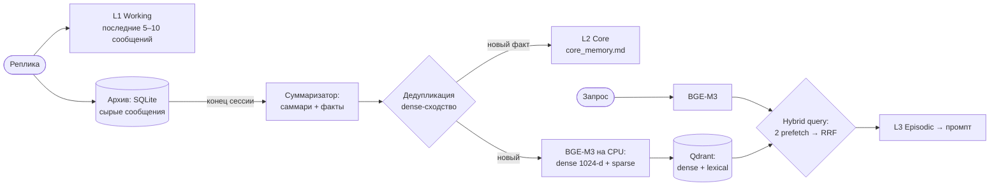

# RAG и память: гибридный поиск, цитирование источников, дедупликация

> Два работающих ретривера с разными задачами и один спроектированный. Долговременная память
> голосового ассистента на гибридном индексе (dense + sparse, RRF), поиск по документам с
> обязательной ссылкой на источник и методика расчёта индекса под продакшен.

**Проекты:** [Запой](zapoy.md) · [AIkimat](aikimat.md) · [smeta-ai-kz](smeta-ai-kz.md) (в плане)
**Стек:** BGE-M3 · Qdrant (hybrid query, RRF) · SQLite · FastAPI · LangGraph · `typing.Protocol`

---

## Запой: память в три уровня на гибридном индексе

| Уровень | Что | Где | Когда попадает в промпт |
|---|---|---|---|
| L1 Working | последние 5–10 сообщений | память процесса | всегда, после статики |
| L2 Core | факты о владельце | `core_memory.md` | всегда, целиком |
| L3 Episodic | саммари сессий и явные факты | Qdrant | топ-N по гибридному поиску |
| Архив | сырые сообщения | SQLite | никогда напрямую |

**Почему гибрид.** Dense-поиск теряет имена, числа и редкие термины — то, что ищут вопросом «что я
говорил про X». Sparse теряет перефразирование. BGE-M3 даёт оба представления за один проход модели,
поэтому гибрид стоит один лишний prefetch внутри Qdrant.

**Почему RRF, а не взвешенная сумма.** Reciprocal Rank Fusion работает по рангам: не нужно
нормировать несравнимые шкалы и подбирать веса, которые легко угадать неправильно.

**Порог только на dense-ветке.** Без него RRF возвращает пять ближайших точек даже на запрос, не
связанный ни с чем в памяти, и каждый промпт тащит пять нерелевантных «воспоминаний». У sparse-ветки
такого порога нет сознательно: её скоры — неограниченные суммы весов терминов, фиксированный срез
там бессмыслен.

**Семантическая дедупликация фактов.** Хэш ловит только побайтовые повторы, а на практике
суммаризатор перефразирует уже известный факт. Core Memory идёт в каждый промпт, так что каждый
дубль — постоянный налог на контекст. Перед записью новый факт сравнивается с индексом, и здесь
используется только dense: перефразирование — ровно то, что ищем, а лексическая половина сочла бы
две формулировки разными.

**Бюджет.** Ретривер укладывается в 200 мс на стадию. HTTP-клиенты к Qdrant и сервису эмбеддингов
живут на уровне модуля: новый клиент на каждый вызов стоил миллисекунды на установке соединения.
BGE-M3 работает на CPU в отдельном контейнере без доступа к GPU, видеопамять остаётся LLM.

**Оценка.** 57 кейсов на поиск по памяти и 54 на факты в собственном eval-движке
([MLOps-кейс](ml-lifecycle.md)).

## AIkimat: поиск по документам с обязательным источником

- Чанкинг по словам: 500 слов с перекрытием 50. Защита от `overlap >= chunk_size`.
- `retrieve(query, top_k, metadata_filter)` поверх `VectorStore` за `typing.Protocol`: хранилище и
  эмбеддинги меняются, не трогая логику.
- Каждый ответ цитирует источник (`format_citation`). В госоргане ответ без ссылки на документ
  бесполезен.
- Честно, как в документации проекта: сейчас эмбеддинги лексические, на хэшах триграмм, а поиск
  линейный в памяти. Первая версия хэшировала строку целиком, и `top_k` возвращал все документы
  подряд — это было незаметно, пока корпус был маленьким. Замена на триграммы — отдельный фикс.
  Путь в прод — реальная мультиязычная модель (класса multilingual-e5 / bge-m3) и pgvector или
  Qdrant.
- Расчёт индекса под продакшен: 10 000 документов ≈ 30 000 чанков ≈ 120 МБ векторов (1024-d,
  fp32) плюс HNSW-индекс в 1,5–3 раза больше. Вывод: хранилище под индекс дёшево относительно GPU.

## smeta-ai-kz: RAG по нормативке — в плане

RAG по корпусу СНиП РК на Qdrant спроектирован, но не реализован: папка `rag/` пока содержит только
описание. Сверка с нормативами в текущем MVP идёт детерминированно, через SQLite-базу расценок и
нечёткое сопоставление.
