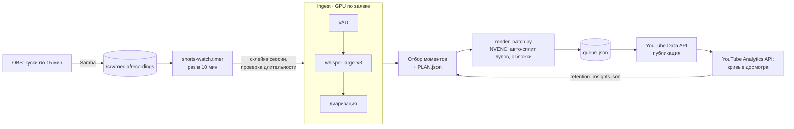

# Shorts-Maker — пайплайн нарезки стримов с петлёй обратной связи от аналитики

> Личный продакшен-пайплайн для YouTube-канала: записи стримов из OBS → транскрипция и диаризация
> на GPU-сервере → отбор моментов → рендер вертикальных клипов → очередь публикации через YouTube API.
> Аналитика досмотров из YouTube Analytics API меняет параметры нарезки для следующих партий.

**Роль:** автор и оператор пайплайна · **Статус:** в эксплуатации, сотни опубликованных клипов
**Стек:** Python · faster-whisper large-v3 (float16) · pyannote 4 · Silero VAD · ffmpeg / h264_nvenc · YouTube Data & Analytics API · Docker · systemd timers · Samba
**Цифры:** 440+ коммитов · 1 260+ тестов · транскрипция с диаризацией ≈14× быстрее реального времени
**Код:** приватный

---

## Как устроено

- Тяжёлые стадии (whisper, диаризация, рендер) идут на сервере в собственном Docker-образе.
  Железо у этого пайплайна общее с платным сервисом, код — нет. Карту он берёт по протоколу заявок
  ([кейс сервера](gpu-server.md)).
- Рендер собирается одной точкой входа `render_batch.py`. У низкоуровневого `render.py` около 60
  флагов, и пропуск любого молча выключает фичу. Один клип так ушёл на канал без бипов на мате и без
  плашки с ником. После этого сборка рендера вручную запрещена.
- Фичи рендера: пословные субтитры, запикивание мата (звук + звёздочки в сабах), плашка с ником,
  social-капсулы, outro-карточка, cold-open тизер, бесшовные лупы, обложки.

## Петля обратной связи: данные меняют конфиг

Скрипт `retention` тянет кривые досмотра по каждому клипу и складывает агрегаты в контрактный файл,
который читается при следующем отборе.

| Длина клипа | Досмотр |
|---|---|
| до 20 с | 64 % |
| 20–25 с | 54 % |
| 25–30 с | 51 % |
| 30–35 с | 50 % |
| 35+ с | 44 % |

- Вывод: ступенька — на **20 секундах**, а не на 25, как казалось по первой выборке. Первую версию
  вывода испортили свежие ролики, которые ещё не набрали просмотров. С тех пор агрегаты считаются
  только по «зрелым» роликам.
- Действие: `max_seconds` 35 → 26. Главный рычаг при этом — нижний порог длины (`min_seconds`), а не
  верхний. По первому разбору 14 из 17 роликов оказались длиннее нужного, следующая партия легла
  в норму.
- Оптимизация: окно запроса аналитики ограничено датой публикации ролика. Прогон сократился
  с 2 часов до 1 мин 42 с.
- Остались открытыми: словарь тегов моментов (149 из 165 тегов встречаются по одному разу — нужен
  фиксированный словарь) и естественный эксперимент на пяти клипах длиннее 26 с.

## Инциденты

| Что случилось | Причина | Фикс |
|---|---|---|
| whisper завис на 10 часов | HuggingFace сверял версию модели по сети без таймаута | `HF_HUB_OFFLINE=1`, веса в томе |
| 400 ГБ склеек на 60 ГБ записей | Сторож пересклеивал сессию на каждом проходе | `prune.py` освободил 288 ГБ; архив оригиналов с проверкой размера и длительности: том 70 % → 15 % |
| Публикация «успешна» (код 0), но ничего не залито | Клипы лежали на сервере, а скрипт искал их на локальном диске | Проверка результата по `queue.json` (`status`/`video_id`), а не по коду возврата |
| `ytAgeRestricted` из-за одной фразы | Контент-фильтр YouTube | `profanity.py --risk-rules`: правила по фразам, а не по корням («член экипажа» — нормальная речь) |
| Раннер убивал собственный `trap` / `pkill -f` рвал свою же SSH-сессию | `exec` в обёртке; слишком широкий паттерн | Переписан раннер, точные PID |
| Диаризация дала 10 голосов на 4 человек в войс-чате | Сжатый звук Discord | Диаризация — опциональный сигнал, а не истина |
| Две копии инструкции пайплайна разошлись на 3 недели | Копирование вместо ссылки | Junction на единственный источник |

## Сиблинг: longcut-maker

Тот же подход для горизонтальных длинных видео 16:9: пресеты `review` / `highlights` /
`full-recap`, фоновая музыка по настроению каждого момента (ambient / energetic / tense / funny),
генерация метаданных YouTube. 25 коммитов, 160+ тестов.
