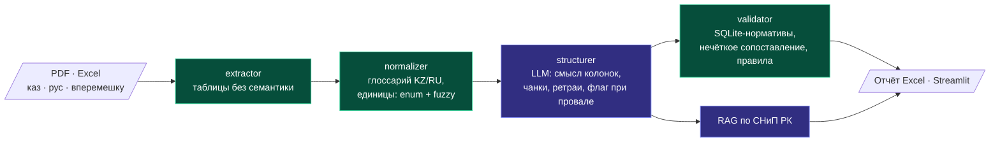

# smeta-ai-kz — AI-проверка строительных смет, где модели не доверены цифры

> MVP для казахстанского девелопера в рамках скаутинга акселератора (BI Group + MOST BI): приём смет
> PDF/Excel на казахском и русском → извлечение позиций → сверка с нормативной базой расценок →
> поиск несоответствий через RAG по СНиП РК → отчёт в Excel и Streamlit-интерфейс.

**Роль:** соло, от спецификации до демо · **Срок:** MVP за 10 дней, развитие после
**Стек:** Python · Claude API · pdfplumber/openpyxl · rapidfuzz · SQLite · RAG · Streamlit · pytest
**Цифры:** 30 коммитов · 66 тестов
**Код:** приватный (в репозиторий не попадают реальные документы заказчика)

---

## Главное решение: граница между моделью и кодом

Ошибка в цифре сметы стоит денег, а языковая модель непредсказуема. Поэтому модели отдана только
семантика: понять, что за позиция и что означают колонки таблицы. Арифметика, единицы измерения и
сверка с базой расценок — детерминированный код, который можно протестировать.

Фиолетовым отмечены шаги с LLM, зелёным — детерминированные шаги.

## Детали

- **Единицы измерения** — фиксированный enum плюс fuzzy-matching с порогом 85. При более низком
  пороге начинают совпадать «м³» и «м²». То, что не совпало, проходит дальше как есть, с флагом,
  а не угадывается.
- **Структурирование таблиц** — по чанкам, с ретраями. Если чанк не распознан, он помечается флагом,
  а не выкидывается молча. После внешнего ревью каждый чанк получает описание колонок исходной
  таблицы: без этого модель путала «количество» и «цену» в продолжениях таблиц.
- **Validator** — SQLite-база нормативов, нечёткое сопоставление позиций, правила перекрёстной
  проверки. Написан роем агентов [swarm-orchestrator](swarm-orchestrator.md) в изолированном
  worktree и принят после ревью.
- **Грабли окружения:** кириллица в пути ломает `tmp_path` у pytest (решено через `--basetemp`),
  reportlab без регистрации TTF-шрифта не пишет кириллицу в тестовых PDF.

## Честные ограничения

Это демо для конкурса, а не продакшен. Нормативная база в тестах синтетическая, реальный корпус
документов в git не попадает. Итог участия в акселераторе в этом кейсе не описан.
