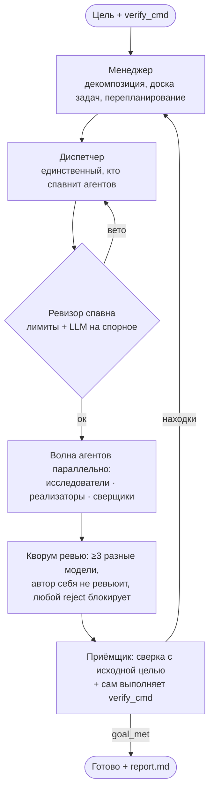

# swarm-orchestrator — рой LLM-агентов, который не верит агентам на слово

> Автономный оркестратор нескольких моделей (Claude, GPT, Nemotron) поверх HTTP-шлюза: раскладывает
> цель на задачи, параллельно раздаёт их агентам, прогоняет каждый артефакт через кворум ревьюеров
> из разных моделей и принимает работу, только выполнив реальную проверочную команду на машине.

**Роль:** автор · **Статус:** используется на реальных задачах в других моих проектах
**Стек:** Python · concurrent.futures · JSON-контракт агентов · pytest (142 теста, покрытие 83 %)
**Код:** публичный — [zhoratolk/swarm-orchestrator](https://github.com/zhoratolk/swarm-orchestrator)

---

## Зачем

Субагенты внутри одного ассистента дорогие и видят мир глазами одной модели. Здесь рой — обычный
Python-процесс. Он сам ходит в шлюз параллельно, распределяет роли между разными семействами моделей
и не принимает результат по самоотчёту агента.

## Роли и цикл

## Инженерные решения

- **Приёмка по факту.** Приёмщик сверяет результат с исходной целью, а не со списком задач, и сам
  выполняет `verify_cmd` — реальную shell-команду: тесты, проверку файла, HTTP-запрос.
- **Защита от command injection.** Если цель декомпозировала LLM, `verify_cmd` написала модель за
  внешним шлюзом, и её ответ никто не читал. Такие команды помечаются `verify_cmd_source: llm` и не
  исполняются без явного `allow_llm_verify_cmd: true`.
- **Условия остановки:** успех; невыполнимость, подтверждённая двумя другими моделями; застой
  (3 итерации без уменьшения числа блокеров); потолок бюджета или устойчивый 429. Прогон при этом
  сохраняется в `board.json`, продолжить можно через `--resume`.
- **Фильтр секретов и персональных данных** (`scrub.py`) перед каждым внешним вызовом: ключи, пароли,
  строки подключения, ФИО, телефоны, ИИН/БИН-подобные числа заменяются на `<SECRET:тип>`. Чужие
  данные уходят только моделям с политикой `no_training`.
- **Учёт стоимости:** факт по `usage.cost` из каждого ответа плюс «теневая» стоимость по
  зафиксированной прайс-таблице. Выяснилось, что одна «бесплатная» модель на самом деле берёт
  деньги. Флаг `free` не гарантирует $0, поэтому проверяется `usage.by_model` в отчёте.
- **Устойчивость:** экспоненциальный ретрай на 429/5xx; мёртвая модель (геоблок 403, 429
  `model_requires_purchase`) выводится из пула на прогон с фолбэком; при обрыве ответа по
  `max_tokens` бюджет удваивается и запрос повторяется; ответы нормализуются, если модель нарушила
  JSON-схему.

## Где применялся

Рой всегда работает в изолированном git worktree, на отдельной ветке. Перед мержем его дифф читает
человек.

- **smeta-ai-kz** — пакет `validator/`: SQLite-база нормативов, нечёткое сопоставление позиций,
  правила перекрёстной проверки.
- **AIkimat** — пагинация `/audit` с обратной совместимостью и настраиваемый `topK` в `/chat`.
- **Сам себя** — прогон самоулучшения на копии собственного кода.
- **Это портфолио** — перевод кейсов на английский с проверкой структуры через `verify_cmd`.
