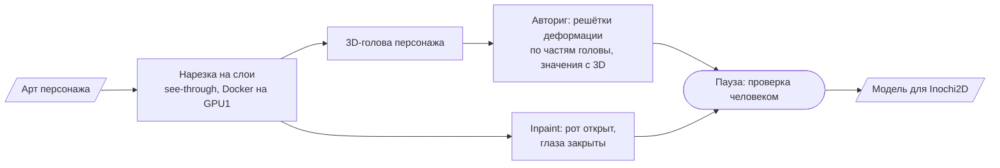

# Vtube ACMT — исследование авто-пайплайна «арт → риг VTuber-модели»

> Контрибьютор в чужом репозитории, работа только через pull request. Цель — от промпта до готовой
> VTuber-модели, а в идеале приложение на телефоне с рендером и трекингом лица. Моя часть — разведка
> технологий и лицензий, GPU-замеры на сервере, пайплайн с проверкой человеком и авториг с опорой
> на 3D-голову персонажа.

**Роль:** контрибьютор (58 коммитов, pull request'ы с разбором «что → почему → варианты → как проверено → риски») · **Статус:** исследование
**Стек:** Python · PyTorch · Docker · Prefect · inpainting-модели · 3D-реконструкция головы · Inochi2D
**Код:** приватный репозиторий владельца проекта

---

## Что сделано

- **GPU-замеры на сервере.** Нарезка `see-through` в Docker-образе на гостевой RTX 3060: сравнение
  времени и пика памяти с эталонным прогоном автора на RTX 3050. Карта берётся через штатный
  протокол заявок, поэтому платная очередь на соседней карте её обходит
  ([кейс сервера](gpu-server.md)). Все веса и прогоны лежат на сервере, в репозитории — только код
  и отчёт.
- **Пайплайн на Prefect:** этапы поверх скриптов демо, паузы на проверку человеком, страница проверки.
- **Авториг головы:** решётка на каждую часть головы (лицо, нос, глаза, чёлка, пряди, уши),
  значения решёток — проекция 3D-головы того же персонажа, повёрнутой на ±30°, с подгонкой по
  наименьшим квадратам. Итог сведён в переносимые правила. Главные из них: «мерить по модели, а не
  по картинке» и «единица измерения — расстояние между глазами, а не пиксели».
- **Лицензионная разведка:** psd2live (GPL-3, серая зона EULA Live2D), модели Illustrious/NoobAI
  (лицензия FAIPL запрещает платный сервис), спорные данные обучения see-through. Решение: свой
  формат, совместимый с Inochi2D, и сменный бэкенд рига, который выбирается тестом.
- **Отрицательный результат тоже записан:** слои «объёма волос» подняли IoU силуэта только с 0.81
  до 0.84 и были забракованы. Этот подход не повторять.
