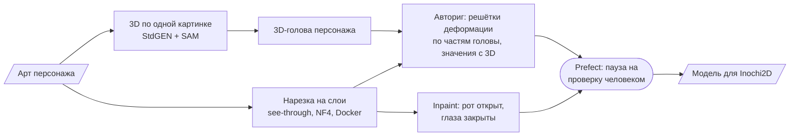

# Vtube ACMT — генеративные модели для авто-рига VTuber: исследование с замерами

> Контрибьютор в чужом репозитории, работа только через pull request. Цель проекта — от промпта до
> готовой VTuber-модели, в идеале приложение на телефоне с рендером и трекингом лица. Моя часть —
> прикладное ML-исследование: запуск генеративных моделей на своём GPU-сервере, замеры времени и
> памяти, 3D-реконструкция персонажа по одной картинке, авториг с опорой на 3D, inpainting,
> пайплайн с проверкой человеком и лицензионная разведка. Отрицательные результаты записаны вместе
> с положительными.

**Роль:** контрибьютор (58 коммитов, pull request'ы по схеме «что → почему → варианты → как проверено → риски») · **Статус:** исследование
**Стек:** Python · PyTorch · Docker · CUDA-расширения (nvdiffrast, pytorch3d) · StdGEN · SAM · see-through · inpainting-модели · Prefect · Inochi2D
**Код:** приватный репозиторий владельца проекта

---

## Что сделано

## Генеративные модели на своём железе: замеры

Все прогоны шли на гостевой RTX 3060 12 ГБ домашнего сервера. Карта бралась через протокол заявок,
так что платная очередь на соседней карте её обходила ([кейс сервера](gpu-server.md)). Веса и
результаты остаются на сервере, в репозитории — только код, Dockerfile и отчёты.

**Нарезка арта на слои (see-through)** — сравнение с эталонным прогоном автора на RTX 3050:

| Прогон | Режим | Время | Пик PyTorch | Итог |
|---|---|---|---|---|
| автор, RTX 3050 | NF4, всё на карте | 30 мин | 6,7 ГБ | работает |
| RTX 3060 | NF4, seed 42 | 12,6 мин | 6,7 ГБ | работает |
| RTX 3060 | тот же прогон повторно | 12,6 мин | 6,7 ГБ | результат совпал байт в байт |
| RTX 3060 | полные веса bf16, выгрузка в RAM | 13,6 мин | 9,6 ГБ | работает |
| RTX 3060 | полные веса bf16, всё на карте | — | — | не влезло в 12 ГБ |

Вывод: на 3060 нарезка идёт в 2,4 раза быстрее эталона, NF4 держит пик памяти PyTorch в 6,7 ГБ,
а прогон детерминирован по seed — повтор совпадает байт в байт.

**3D-реконструкция по одной картинке (StdGEN, CVPR 2025)** — около 11 минут на персонажа: 7,5 минут
на генерацию 6 ракурсов × 3 семантических уровня, ~2 минуты на доводку. Веса — 48 файлов на 19 ГБ
плюс SAM ViT-H. Стадия 3 в исходной конфигурации не влезает в 12 ГБ: `torch.index_select` просит
10,73 ГиБ одним тензором при 8,3 ГиБ свободных. Upstream на свежих зависимостях не собирается —
разобрал три места и описал их в Dockerfile (например, `nvdiffrast` и `pytorch3d` собираются
только с `--no-build-isolation` против уже установленного torch).

**Рендер превью на CPU сервера** в контейнере на 36 потоках: 240 кадров за 1,5–2,5 минуты вместо 9 —
GPU для этого не нужен.

## Что 3D даёт для рига — в числах

- **Сколько «нового» появляется при повороте.** При повороте головы на ±30° 13–14 % силуэта — это
  области, которых на плоской картинке нет вообще, у волос — 22–24 %. При повороте с наклоном вверх
  — до 33–34 %. Это оценка того, сколько плоский риг обязан «додумать».
- **Авториг по 3D-голове.** Решётка деформации на каждую часть головы (лицо, нос, глаза, чёлка,
  пряди, уши). Значения решёток — проекция 3D-головы того же персонажа на ±30° с подгонкой по
  наименьшим квадратам. Итог сведён в переносимые правила: «мерить по модели, а не по картинке»,
  «единица измерения — расстояние между глазами, а не пиксели».
- **Сверка с ручным ригом риггера.** Скрипт снимает с наших ключевых поз те же величины, что были
  намеряны с эталонной модели. IoU силуэтов с 3D на ±20° — 0,80–0,84 против 0,864 в покое.
- **Склеенная чёлка против прядей.** Один кусок воспроизводит 85 % смещений: разброс между прядями —
  0,216 межглазного расстояния, а ошибка склейки — 0,031 в среднем.

## Отрицательные результаты — тоже результат

- **Разрезать склеенную чёлку обратно на пряди не удалось.** Цель — 4 из 5 прядей с IoU ≥ 0,7 — не
  достигнута. Добавление предсказанной моделью глубины сделало хуже: средний IoU упал с 0,57 до
  0,515.
- **Слои «объёма волос»** подняли IoU силуэта с 0,81 до 0,84, но результат забраковали по виду.
  Этот путь закрыт, повторять не нужно.

## Пайплайн и лицензии

- **Prefect-пайплайн:** этапы поверх скриптов демо, паузы на проверку человеком, страница проверки.
- **Inpaint** вариантов «рот открыт» / «глаза закрыты» по маске, анимация рта, проверка моргания и
  сравнение с ригом автора.
- **Лицензионная разведка:** psd2live (GPL-3, серая зона EULA Live2D), модели Illustrious/NoobAI
  (лицензия FAIPL запрещает платный сервис), спорные данные обучения see-through. Решение: свой
  формат, совместимый с Inochi2D, и сменный бэкенд рига, который выбирается тестом.
