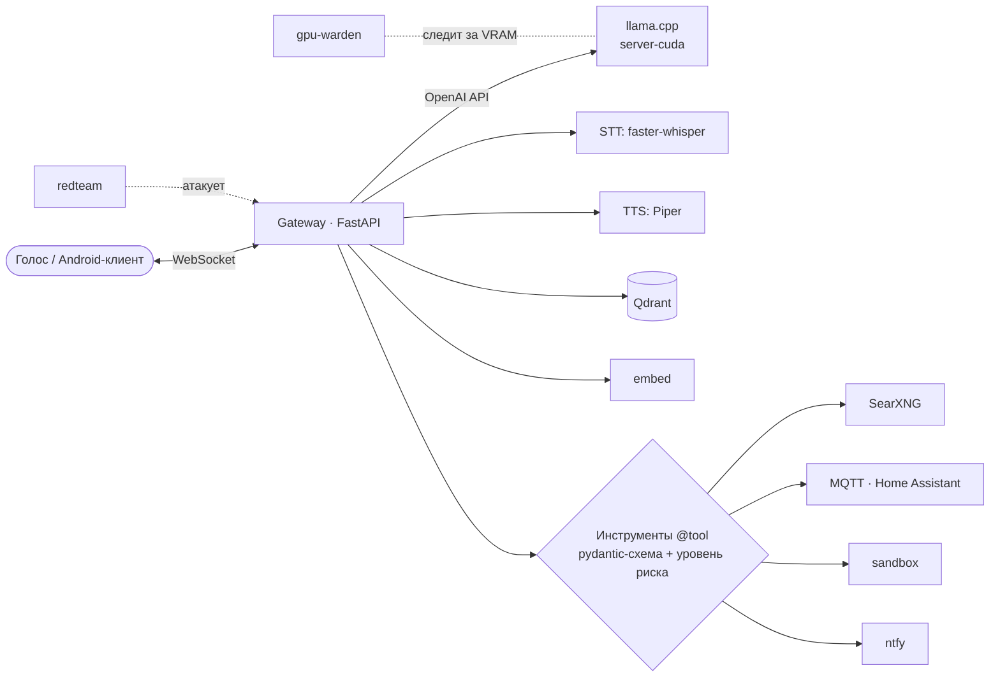

# Запой — локальный голосовой ассистент: модульный монолит на Docker Compose

> Автономный ассистент без облака: локальная LLM, распознавание и синтез речи, долговременная
> память, веб-поиск и умный дом. Ядро знает только OpenAI-совместимый URL, поэтому любую модель
> можно заменить одной строкой в `.env`.

**Роль:** автор · **Статус:** развёрнут на домашнем GPU-сервере; Android-клиент написан, но ещё не собирался
**Стек:** FastAPI · llama.cpp server (CUDA, GGUF) · speaches / faster-whisper large-v3 · Piper TTS · Qdrant · SearXNG + trafilatura · MQTT (mosquitto) / Home Assistant · ntfy · Docker Compose profiles · Kotlin (Android)
**Цифры:** 170+ тестов
**Код:** приватный

---

## Слои

| Слой | Сейчас | Как заменить |
|---|---|---|
| Мозг | llama.cpp server (GGUF) | строка `LLM_GGUF` в `.env` |
| STT | speaches / faster-whisper large-v3 | `STT_MODEL` |
| TTS | Piper | путь к голосу |
| Память | Qdrant | — |
| Поиск | SearXNG + trafilatura | — |
| IoT | MQTT / Home Assistant | — |

## Инженерные решения

- **Профили compose** (`voice`, `web`, `iot`): поднимается только нужное. Базовый набор — `llm`,
  `qdrant`, `gateway`.
- **Инструменты с уровнем риска:** декоратор `@tool` с pydantic-схемой и `Risk.CONFIRM`. Опасный
  вызов (например, команда на ПК) блокируется до подтверждения человеком: приходит
  push-уведомление ntfy с кнопками «Разрешить / Запретить». Команды выполняются в отдельном
  контейнере `sandbox`.
- **Red-team на косвенный prompt injection:** отравленные страницы подаются через настоящий
  инструмент `fetch_page`, а по SSE-потоку проверяется, выполнился ли после недоверенного ввода
  хоть один заблокированный инструмент. Вердикты: `BLOCKED` / `IGNORED` — тест пройден,
  `LEAKED` / `EXECUTED` — провал.
- **Стабильный префикс промпта** — побайтово: всё динамическое идёт строго после статической части,
  иначе инвалидируется KV-кэш llama.cpp и каждый ответ считается с нуля.
- **Один протокол на два клиента:** `gateway/app/voice/ws.py` — источник правды, Kotlin-клиент
  повторяет фреймы. На Android — шумоподавление RNNoise (веса проверяются по sha256).

## Грабли

- В свежих сборках `llama.cpp` флаг `-fa` требует значение (`-fa on`), иначе сервер не стартует.
- CDI игнорирует `NVIDIA_DRIVER_CAPABILITIES`, поэтому карты пробрасываются через `device_ids`.
- Опубликованные порты Docker обходят ufw хоста. Решение — биндить порты на конкретный адрес или
  писать правила в цепочку `DOCKER-USER`.
